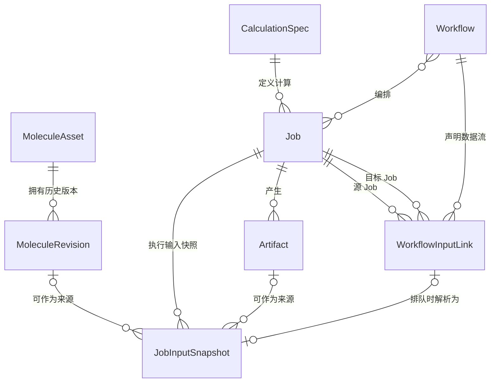
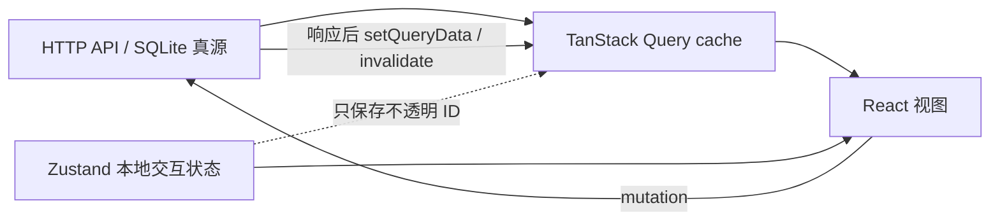

# RetainMol 数据模型

本目录定义分子版本、计算任务、工作流和计算产物的统一数据模型。它是 v1 的目标契约，也是迁移现有 Job SQLite 数据时的判定依据。

> **分子资产实现基线（2026-07-15）**：schema 6 已物化 Asset head/version、Revision 摘要和不可变来源 metadata，数据库触发器保护快照；前后端共享规范哈希契约。编辑器提交 xTB 前会先保存 Revision，Job 只绑定 `moleculeRevisionId`；优化结果载入后保存的新 Revision 会记录来源 Job/Artifact。旧 Artifact 离线回填仍待实施。

## 文档导航

- [实体定义](./entities.md)：职责、ID、不可变性、关系和约束。
- [MoleculeAsset / MoleculeRevision 契约](./molecule-assets.md)：schema 6 实现、service/API、来源追踪、head 乐观并发和 Job 冻结边界。
- [Job 输入快照](./input-snapshots.md)：输入端口、冻结事务、Workflow 解析和兼容边界。
- [Job 创建契约 v1](./job-create-contract-v1.md)：分层创建请求、Task Contract、输入来源和执行策略。
- [生命周期](./lifecycles.md)：Job 状态机、输入解析和 Artifact 提交流程。
- [v1 迁移](./migration-v1.md)：SQLite 现状、迁移步骤和兼容窗口。

## 设计原则

1. **身份与内容分离**：业务实体使用不透明 ID；内容摘要用于完整性校验和去重，不能替代业务身份。
2. **输入必须冻结**：Job 进入 `queued` 前，所有可变来源都解析成不可变的 `JobInputSnapshot`。
3. **结果只追加、不覆盖**：一次执行只对应一个 Job。重算、改参数或恢复失败任务均创建新 Job。
4. **分子编辑产生 Revision**：`MoleculeAsset` 表示长期对象，保存操作创建新的不可变 `MoleculeRevision`，不原地改写历史版本。
5. **Workflow 描述依赖，不承载结果**：工作流边在执行前解析为具体绑定；已排队或已执行 Job 不因工作流编辑而改变。
6. **SQLite 是元数据真源**：文件系统保存 blob 字节；相对路径只是存储实现，不能成为 API 或实体关系。

## 总体关系

多态来源的约束如下：

- 一个 `JobInputSnapshot` 只能选择 `literal`、`molecule_revision`、`artifact` 三种来源之一。
- 一个 `Artifact` 只属于一个直接生产 Job；文件导入也通过 import Job 建立 provenance。
- 一个 `MoleculeRevision` 自身保存规范结构 JSON 和摘要；从 Revision 导出的文件可另建 Artifact，但二者不共享身份。
- 一个 `WorkflowInputLink` 只描述同一 Workflow 内两个 Job 之间的数据边；排队时解析成目标 Job 的输入快照。

## 当前模型与 v1 对照

| 关注点 | 当前实现 | v1 目标 |
| --- | --- | --- |
| 分子持久化 | schema 6、service/API、跨运行时哈希、编辑器保存/历史恢复、计算来源追踪与 CAS 冲突 UI 已接通 | 自动保存、分支合并和权限审计 |
| 计算定义 | 新 xTB Job 原子写入独立 `CalculationSpec`；runner 优先读取 Spec，metadata 仅兼容旧任务 | 所有引擎统一使用版本化 Spec schema |
| Job 输入 | Snapshot 覆盖 literal/Revision/Artifact；Revision 摘要在排队和 runner 读取时校验 | 逐步缩小历史 `metadata.request` 回退窗口 |
| Artifact 内容 | 新增文件由 service 发布到 SHA-256 内容地址；legacy path 保留只读兼容 | 补齐旧文件离线回填和完整性状态 |
| Workflow | 已持久化 Job ID 与引用 DAG；Artifact 引用优先使用稳定 ID | 增加版本检查和排队冻结规则 |
| Job 状态 | 服务层校验状态图，repository 用 CAS 更新并追加事件 | 增加取消 API、runner lease 与恢复器 |
| SQLite schema | repository 启动统一调用版本化迁移，当前 schema 6 | 后续仅通过新增迁移演进，不再内联改表 |

## 前端 Query / Zustand 边界

TanStack Query 管理**服务端状态**；Zustand 管理**本地交互状态**。同一份服务端实体不得同时在两个容器中成为真源。

### TanStack Query 负责

- `MoleculeAsset`、`MoleculeRevision`、`CalculationSpec`、`Job`、`Artifact`、`Workflow` 的列表和详情。
- Job 状态轮询、请求错误、加载状态、缓存失效和 mutation 的服务端响应。
- Artifact 元数据及按需读取的解析结果；大文件字节不复制进 Zustand。
- 以实体 ID 构造稳定 query key，例如 `['jobs', 'detail', jobId]` 和 `['molecules', assetId, 'revisions', revisionId]`。

### Zustand 负责

- `selectedJobId`、`activeMoleculeAssetId`、`activeRevisionId` 等当前选择。
- 未保存的分子工作副本、编辑历史、选区、工具模式、面板尺寸和对话框开关。
- Workflow 编辑器的临时草稿；保存成功后以 Query 返回的 Workflow 替换草稿基线。
- 浏览器内短任务的进度和 busy 状态；持久 Job 的 `status` 仍只来自 Query。

### 禁止的跨界方式

- 不把完整 Job/Workflow 列表复制到 Zustand，也不在 Zustand 中维护第二套 `status`。
- 不让组件直接修改 Query cache 中的 Revision 内容；保存工作副本必须调用 mutation 创建新 Revision。
- 不把 Query cache 当持久层；刷新后必须能由 API 重建。
- Zustand 只用 ID 关联服务端实体，不保存 SQLite 路径、blob 存储键或外部服务凭据。
