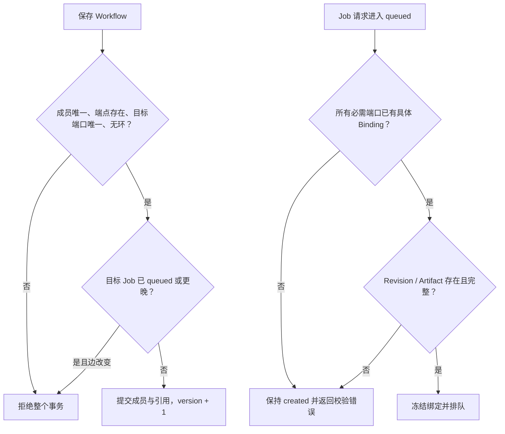

# 实体定义

## ID 通则

- 所有 ID 由后端生成、全局不复用，并作为不透明字符串传给客户端。
- 客户端不得从前缀、日期或字典序推断类型、时间或执行顺序。
- 迁移必须原样保留现有 ID。当前 `Job` 的 `YYYYMMDD-<8 hex>`、`artifact-<16 hex>`、`workflow-<16 hex>` 和 `reference-<16 hex>` 都是合法 v1 ID。
- 新实体建议使用 `<type>_<ULID>`，例如 `mol_...`、`rev_...`、`spec_...`、`binding_...`；前缀只便于排障，不属于业务语义。
- 外键保存 ID，不保存对象副本或文件路径。时间统一为 UTC ISO 8601，并在 SQLite 中按文本保存。

## MoleculeAsset

`MoleculeAsset` 是用户认知中的“同一个分子”，为持续编辑、命名、归档和权限提供稳定身份。它不直接保存原子和键。

> **实施状态：编辑器主链路已实现。** schema 6 已物化 `head_revision_id` 和 `version`；repository/service/HTTP API 通过 expected head + expected version 完成原子 CAS，编辑器保存、历史载入与计算提交均使用该契约。完整契约见 [MoleculeAsset / MoleculeRevision 契约](./molecule-assets.md)。

| 项 | 定义 |
| --- | --- |
| ID | API 使用 `id`，建议值为 `mol_<ULID>`；SQLite 使用 `asset_id` |
| 核心字段 | `schemaVersion`、`name`、`headRevisionId`、`version`、`createdAt`、`updatedAt` |
| 可变性 | **可变聚合根**。名称和 head 指针可变；保存 Revision 时以请求的 `parentRevisionId` 作为 expected head。 |
| 关系 | 1:N 拥有 `MoleculeRevision`；`headRevisionId` 必须指向本 Asset 的 Revision。 |

约束：

- Asset 可以先以 `headRevisionId = null` 创建；首个 Revision 保存成功后才设置 head。
- 切换 head 只改变默认打开版本，不删除或改写旧 Revision。
- 同时编辑发生冲突时，服务端拒绝与当前 head 不同的 `parentRevisionId`；客户端基于最新 head 重放。显式分支不属于本阶段公开 API。

## MoleculeRevision

`MoleculeRevision` 是一次已保存的完整分子快照，包含拓扑、稳定原子 ID、三维坐标、电荷等可复现数据。文档统一称为 Revision；数据库表建议命名 `molecule_revisions`，避免与其他版本号混淆。

> **实施状态：基础链路已实现。** schema 6 要求内容摘要和拓扑摘要，支持不可变 provenance metadata，并用数据库触发器禁止 Revision UPDATE/DELETE；service 会规范化结构、复算摘要并校验客户端值，HTTP API 与 xTB Revision 输入路径已有端到端测试。

| 项 | 定义 |
| --- | --- |
| ID | API 使用 `id`，建议值为 `rev_<ULID>`；SQLite 使用 `revision_id` |
| 核心字段 | `schemaVersion`、`assetId`、`parentRevisionId`、`molecule`、`contentHash`、`topologyFingerprint`、`createdAt` |
| 可变性 | **完全不可变**。修正名称以外的结构信息必须创建新 Revision；审计信息也只追加。 |
| 关系 | N:1 属于 `MoleculeAsset`；可有一个同 Asset 父 Revision；可被多个 Job 绑定。 |

`molecule` 使用 RetainMol 的规范序列化。`contentHash` 是完整规范 JSON（含坐标）的 SHA-256；`topologyFingerprint` 是忽略笛卡尔坐标后的规范拓扑 SHA-256，二者都不是 Revision ID。SQLite 将规范 JSON 保存为 `structure_json`，并分别持久化 `sha256` 与 `topology_fingerprint`。父链用于历史导航，不要求是单链；显式分支不是本阶段公开 API。需要下载 SDF/XYZ 等文件时创建独立 Artifact，并记录导出所用 Revision ID。

## CalculationSpec

`CalculationSpec` 描述“算什么和如何算”，但不包含某次运行的具体分子或产物。它用于复用参数、验证输入端口和解释 Job。

| 项 | 定义 |
| --- | --- |
| ID | `calculationSpecId`，建议 `spec_<ULID>` |
| 核心字段 | `specId`、`schemaVersion`、`kind`、`engine`、`payload`、`specDigest`、`createdAt` |
| 可变性 | **不可变**。被 Job 引用后永不原地更新；新参数或 schema 创建新 Spec。 |
| 关系 | 1:N 被 Job 引用。 |

`payload` 只保存方法、收敛阈值、输入端口 schema 等静态配置。分子、上游 Artifact 和每次运行不同的值属于 `JobInputBinding`。SQLite 可以把 payload 中的常用 `method` 和参数拆列/拆 JSON 保存，但 API 语义不变。`specDigest` 对规范化 Spec JSON 求 SHA-256，可用于去重和缓存，但不替代 ID。

## Job

`Job` 表示一次可审计的计算尝试，是状态、输入快照、日志和结果 provenance 的根。一个 Job 最多执行一次。

| 项 | 定义 |
| --- | --- |
| ID | `jobId`；迁移后保留当前格式，新实现仍按不透明字符串处理 |
| 核心字段 | `specId`、`status`、`name?`、`createdAt`、`queuedAt?`、`startedAt?`、`finishedAt?`、`updatedAt`、`errorCode?`、`errorMessage?`、`stateVersion`、`supersedesJobId?` |
| 可变性 | 身份、Spec 和创建时间不可变；schema 4 正式提交中的 `created` 是 create → bind → queue 事务内状态，不提供原地改写 Binding 的窗口；进入 `queued` 后仅状态、租约、进度和终止信息可按状态机更新。 |
| 关系 | N:1 引用 `CalculationSpec`；1:N 拥有绑定和产物；可属于多个 Workflow。 |

约束：

- 重新运行必须创建新 Job，可用 `supersedesJobId` 说明来源。
- `succeeded`、`failed`、`cancelled`、`interrupted` 是终态，不得回到 `queued`。
- 每次成功状态迁移追加一个 `JobStatusEvent`，以 `(jobId, stateVersion)` 唯一；事件不能更新或删除。
- 计算输出只在 `running` 中登记；终态后不得覆盖。额外派生结果应由新 Job 产生并引用原 Artifact。
- 当前 `task_type` 和 `metadata.request` 在 v1 迁移时投影为 Spec；过渡期 API 可继续返回旧字段。

## JobInputBinding

`JobInputBinding` 是目标输入端口到**具体不可变值**的绑定。它回答“这次 Job 实际读取了什么”，不回答“工作流原本想从哪里取”。

> **实施状态：xTB 主路径已实现。** Binding 的 SQL/模型支持三类来源；xTB 端口接受规范 Molecule Revision，排队时冻结 ID 与摘要，runner 执行前重新校验内容。其他计算引擎仍需各自注册端口契约。完整契约见 [JobInputBinding 设计](./bindings.md)。

| 项 | 定义 |
| --- | --- |
| ID | `jobInputBindingId`，建议 `binding_<ULID>` |
| 核心字段 | `bindingId`、`jobId`、`inputName`、`sourceKind`、`literalJson?`、`moleculeRevisionId?`、`artifactId?`、`contentSha256`、`resolvedFromReferenceId?`、`createdAt` |
| 可变性 | Binding 创建后不可更新；正式提交在同一事务中创建 Job、绑定输入并进入 `queued`。输入变化创建新 Job。 |
| 关系 | N:1 属于 Job；按来源可选引用一个 Revision 或 Artifact；可追溯到一个 `JobInputReference`。 |

必须满足异或约束：

| `sourceKind` | 唯一允许有值的字段 |
| --- | --- |
| `literal` | `literalJson` |
| `molecule_revision` | `moleculeRevisionId` |
| `artifact` | `artifactId` |

同一 Job 的 `inputName` 唯一。`literalJson` 只用于小型标量或结构化参数，不得塞入大文件、base64 blob 或可变文件路径。

## Artifact

`Artifact` 是一个有业务语义和 provenance 的不可变内容记录，例如输入文件、优化坐标、日志、轨迹、缩略图或规范分子快照。

| 项 | 定义 |
| --- | --- |
| ID | `artifactId`；保留当前 ID，新记录建议 `artifact_<ULID>` |
| 核心字段 | `jobId`、`role`、`name`、`mediaType`、`format`、`sha256`、`byteSize`、`storageKey`、`metadataJson`、`createdAt`、`integrityState` |
| 可变性 | **记录和字节均不可变**。显示名、metadata 和 blob 内容不能原地更新；替换内容创建新 Artifact。 |
| 关系 | N:1 属于直接生产 Job；可被多个绑定或派生 Artifact 引用。导入文件由 import Job 产生。 |

### 内容寻址

- `sha256` 固定为 64 个小写十六进制字符，对文件的原始字节计算。
- `storageKey` 由服务端从摘要导出，固定为 `sha256/<前两位>/<完整摘要>`；磁盘根目录当前规划为 `<data_root>/artifacts/`，API 不返回本机绝对路径。
- Artifact ID 与摘要分离。两个 Job 产生相同字节时创建两个 Artifact 记录以保留各自 provenance，但可共享同一个只读 blob。
- 写入顺序是：写临时文件、流式计算摘要和大小、原子移动到内容地址、事务插入 Artifact。目标 blob 已存在时校验大小后复用。
- 下载时按策略抽样或全量复算摘要；不匹配则把 `integrityState` 标为 `corrupt`、停止提供内容并报警，不能静默修复。
- blob 只有在没有任何 Artifact 引用且超过垃圾回收宽限期后才可删除。

当前 `artifacts.path` 是任务目录相对路径，既非内容身份也非稳定 API。其迁移和缺失文件处理见 [migration-v1.md](./migration-v1.md)。

## JobInputReference

`JobInputReference` 是 Workflow 中的设计时依赖边，将目标 Job 的命名输入端口指向上游 Job 的命名来源。

| 项 | 定义 |
| --- | --- |
| ID | `referenceId`；保留当前格式，新记录建议 `reference_<ULID>` |
| 核心字段 | `workflowId`、`targetJobId`、`targetInputName`、`sourceJobId`、`sourceKind`、`sourceName`、`sourceArtifactId?`、`createdAt` |
| 可变性 | 单条引用**不可变**；修改边时删除旧引用并创建新 ID。Workflow 图本身可在冻结规则内更新。 |
| 关系 | N:1 属于 Workflow；源、目标 Job 都必须属于该 Workflow；解析后最多对应一个绑定。 |

`sourceKind` 当前允许：

- `artifact`：有 `sourceArtifactId` 时精确引用该 Artifact，并校验它属于 `sourceJobId`；否则由 `sourceName` 选择上游 Job 的命名输出，运行前必须唯一解析。
- `input`：`sourceName` 选择上游 Job 已冻结的命名绑定，并复制其不可变来源。

不允许自环、环路或同一 `(workflowId, targetJobId, targetInputName)` 的重复边。引用 Artifact 时，来源 Job 必须成功且格式满足目标 Spec；引用输入时，来源绑定必须已冻结。

## Workflow

`Workflow` 是持久化 DAG，组织 Job 及其输入引用。它负责可视化、验证和调度顺序，不复制 Job、Spec 或 Artifact 内容。

| 项 | 定义 |
| --- | --- |
| ID | `workflowId`；保留当前格式，新记录建议 `workflow_<ULID>` |
| 核心字段 | `name`、`version`、`createdAt`、`updatedAt`；成员顺序保存在关联表 |
| 可变性 | **可变聚合根**。保存时整图校验并令 `version + 1`；已排队 Job 的绑定不可随图更新。 |
| 关系 | M:N 包含 Job；1:N 拥有 `JobInputReference`。 |

成员列表顺序只用于稳定展示和同层节点排序，执行顺序必须由 DAG 拓扑排序得到。更新 Workflow 不得删除 Job 本身，也不得改写 Job 的状态、绑定或 Artifact。

## 关系不变量

