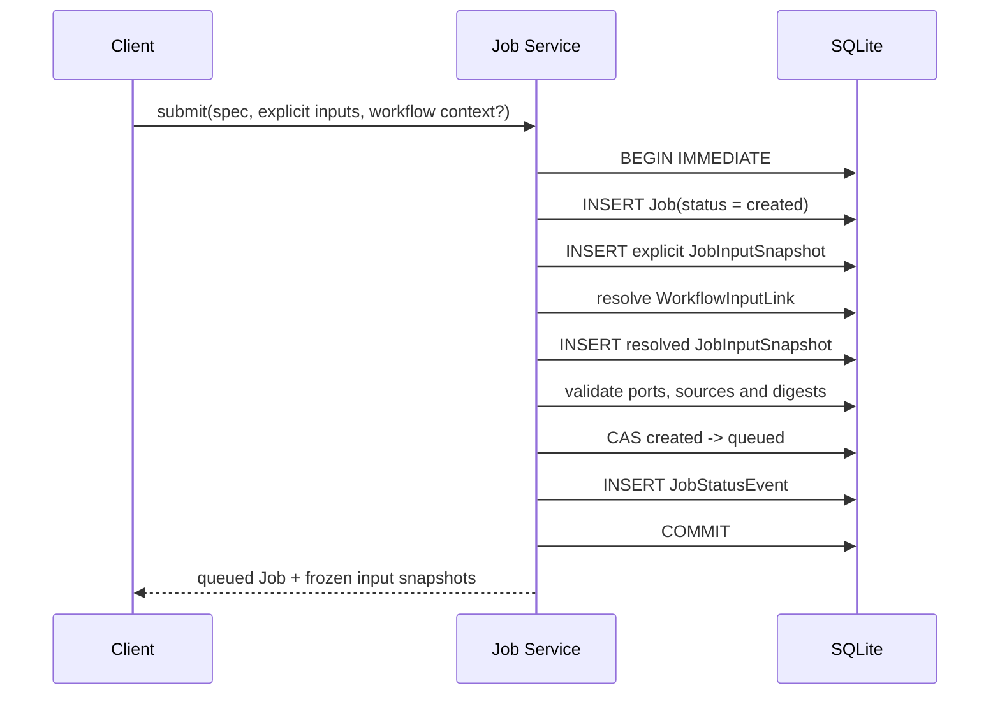

# JobInputSnapshot 设计

> **分子来源状态：xTB 主路径已实现。** schema 4 引入输入快照，schema 5 完成不可变 Molecule Revision；Molecule service/API、xTB 端口校验、排队摘要冻结和 runner 消费已端到端接入。历史 xTB Job 仍保留 `metadata.request` 回退。

## 为什么需要 Snapshot

`CalculationSpec` 描述计算方法，`JobInputSnapshot` 描述某一次 Job 实际读取的不可变输入。两者必须分离：相同的 xTB 参数可以用于不同分子，而一次已经排队的计算不能因为分子被继续编辑、Workflow 被改线或文件被覆盖而改变输入。

Snapshot 需要同时回答：

1. 目标计算端口是什么，例如 `structure` 或 `constraints`；
2. 输入来自字面量、分子版本还是计算产物；
3. 解析时看到的内容摘要是什么；
4. 如果输入来自 Workflow，具体由哪条输入链接解析而来。

## schema 4 实体

Python 领域模型使用 `JobInputSnapshot`、`snapshot_id` 和 `resolved_from_link_id`。为了不在本轮引入数据库迁移和前端破坏，SQLite 仍沿用历史表 `job_input_bindings`，HTTP JSON 仍沿用 `bindings`、`bindingId` 与 `resolvedFromReferenceId`。这些旧名只属于兼容边界，新代码不得把它们带回 service 和 domain 层。

| API 字段 | SQLite 字段 | 类型 | 约束与含义 |
| --- | --- | --- | --- |
| `bindingId` | `binding_id` | string | 主键，不透明且全局不复用，建议 `binding_<ULID>` |
| `jobId` | `job_id` | string | 必填，外键指向 `jobs.job_id` |
| `inputName` | `input_name` | string | 必填，对应 CalculationSpec 声明的输入端口 |
| `sourceKind` | `source_kind` | enum | `literal`、`molecule_revision`、`artifact` 三选一 |
| `literalJson` | `literal_json` | JSON text? | 仅 `literal` 来源有值，保存规范 JSON |
| `moleculeRevisionId` | `molecule_revision_id` | string? | 仅 `molecule_revision` 来源有值 |
| `artifactId` | `artifact_id` | string? | 仅 `artifact` 来源有值 |
| `contentSha256` | `content_sha256` | string | 必填，绑定创建时解析出的 64 位小写 SHA-256 |
| `resolvedFromReferenceId` | `resolved_from_reference_id` | string? | 兼容字段；Workflow 链接解析产生快照时，指向原 `WorkflowInputLink` |
| `createdAt` | `created_at` | UTC timestamp | 必填，创建后不修改 |

同一 Job 的端口只能冻结一次：

```sql
UNIQUE (job_id, input_name)
```

`sourceKind` 与三个来源字段必须满足严格三选一：

```sql
CHECK (
  (
    source_kind = 'literal'
    AND literal_json IS NOT NULL
    AND molecule_revision_id IS NULL
    AND artifact_id IS NULL
  )
  OR
  (
    source_kind = 'molecule_revision'
    AND literal_json IS NULL
    AND molecule_revision_id IS NOT NULL
    AND artifact_id IS NULL
  )
  OR
  (
    source_kind = 'artifact'
    AND literal_json IS NULL
    AND molecule_revision_id IS NULL
    AND artifact_id IS NOT NULL
  )
)
```

其他目标约束：

- `content_sha256` 必须匹配 `^[0-9a-f]{64}$`；SQLite 负责长度和字符检查，service 负责重算校验。
- `literalJson` 必须使用稳定键顺序和固定数值编码后再计算摘要，不允许保存文件路径、base64 大对象或凭据。
- Revision 来源记录其规范分子 JSON 的 `contentHash`；Artifact 来源记录 Artifact 的 `sha256`。
- `resolvedFromReferenceId` 有值时，链接的目标 Job 和 `inputName` 必须与 Snapshot 一致。
- Snapshot 行创建后不可更新。正式提交采用新 Job 表达输入变化，不原地改写已经审计的输入事实。

## 计算输入端口

每种 `kind + engine + schemaVersion` 必须注册一份输入端口契约。端口定义属于计算适配器，不属于 React 组件，也不能由 runner 临时猜测。

```ts
interface CalculationInputPort {
  name: string
  required: boolean
  valueKind: 'structure' | 'json' | 'file'
  acceptedSourceKinds: Array<'literal' | 'molecule_revision' | 'artifact'>
  acceptedFormats?: string[]
  multiple: boolean
}
```

排队校验至少包括：

- 所有必需端口都存在，未知端口被拒绝；
- 单值端口只有一个 Snapshot；schema 4 首轮不开放多值端口；
- `sourceKind` 在端口允许列表中；
- Artifact 的 `format`、`role` 和完整性状态符合端口要求；
- MoleculeRevision 存在、摘要一致，并且能导出该引擎需要的结构格式；
- literal 能通过端口对应的 JSON schema 或 Pydantic 校验。

端口契约可以由后端 registry 提供，并在 `CalculationSpec.payload.inputPorts` 中保存创建时使用的版本化快照。runner 只消费已验证 Snapshot，不自行选择输入。

## 原子提交：create → freeze → queue

schema 4 的正式提交接口必须在一个 SQLite 事务中完成 Job 创建、输入绑定和排队。前端未提交的表单和分子工作副本继续保留在本地状态，不需要先创建可长期修改的服务端 Job 草稿。



任何一步失败都回滚整个事务，不留下半绑定的 Job。禁止以下做法：

- 先创建 `queued` Job，再异步补输入；
- 在不同事务中解析 Workflow 和更新 `queued`；
- runner 启动后再从“当前分子”或文件名寻找输入；
- 对已经创建的 Snapshot 执行 UPDATE；
- 为了重跑而把终态 Job 改回 `queued`。

runner 只能通过 `jobId` 读取 `CalculationSpec + JobInputSnapshot`，准备私有工作目录，然后以只读方式消费 Revision 或 Artifact 内容。

## MoleculeRevision 来源

从已保存分子提交时，客户端只能指定具体 `moleculeRevisionId`，不能指定 `moleculeAssetId`、`head` 或省略版本让服务端在 runner 启动时解析。目标排队步骤为：

1. 读取 Revision 并确认 `sha256/contentHash` 为有效摘要；schema 5 可验证的规范 Revision 才能进入 runner，无法通过结构校验的 legacy Revision 不可直接排队。
2. 校验目标输入端口接受 `sourceKind = molecule_revision` 和 RetainMol 规范结构。
3. 复算或按完整性策略验证 `structure_json`，把 Revision ID 和当时摘要写入 Snapshot。
4. 与 Spec、Job 创建及 `created -> queued` 在同一事务提交。
5. runner 按 Snapshot 读取 Revision 并再次比对摘要，不查询 Asset head。

因此 Asset head 在 Job 排队后继续前进不会影响该 Job。Revision 也不能因为已有 Snapshot 而被原地修复；若历史行内容或摘要不可信，应显式迁移为新的 Revision，或拒绝排队。

完整的 create asset、save revision 和 head CAS 契约见 [MoleculeAsset / MoleculeRevision 契约](./molecule-assets.md)。

## WorkflowInputLink 解析

`WorkflowInputLink` 是设计时的数据流意图，`JobInputSnapshot` 是排队时冻结的执行事实。链接必须在上述提交事务中解析为具体来源。

### Artifact 链接

1. 优先使用稳定的 `sourceArtifactId`，并确认 Artifact 属于 `sourceJobId`。
2. 来源 Job 必须为 `succeeded`，Artifact 必须可用且摘要校验通过。
3. Artifact 格式必须满足目标 CalculationInputPort。
4. 创建 `sourceKind = artifact` 的 Snapshot，并写入 `artifactId`、`contentSha256` 和兼容字段 `resolvedFromReferenceId`。
5. `sourceName` 只作为 legacy 回退；若同名输出不唯一则拒绝排队，不能任意选择一个。

### 上游输入引用

当 `sourceKind = input` 时，解析器读取上游 Job 已冻结的同名 Snapshot，把其 literal、Revision ID 或 Artifact ID 复制为新的目标 Snapshot，并重新记录摘要。不能复制任务目录路径，也不能让两个 Job 共享一条 Snapshot 行。

显式输入和 Workflow 链接若同时占用同一 `inputName`，提交失败，不设置隐式覆盖优先级。Workflow 后续编辑不影响已经生成的 Snapshot。

## xTB 示例

以下是当前 xTB Revision 输入在服务层冻结后的 Snapshot 表达；HTTP 创建任务时客户端只提交 `moleculeRevisionId`，由服务端生成兼容格式的 `bindingId` 和摘要。

### 1. CalculationSpec

```json
{
  "specId": "spec_example",
  "schemaVersion": 1,
  "kind": "geometry-optimization",
  "engine": "xtb",
  "payload": {
    "method": "gfn2",
    "charge": 0,
    "multiplicity": 1,
    "optimizationLevel": "tight",
    "maxSteps": 300,
    "inputPorts": [
      {
        "name": "structure",
        "required": true,
        "valueKind": "structure",
        "acceptedSourceKinds": ["molecule_revision", "artifact"],
        "acceptedFormats": ["retainmol-molecule", "xyz", "sdf"],
        "multiple": false
      }
    ]
  }
}
```

### 2. 从已保存分子提交

```json
{
  "bindingId": "binding_example_revision",
  "jobId": "20260714-a1b2c3d4",
  "inputName": "structure",
  "sourceKind": "molecule_revision",
  "moleculeRevisionId": "rev_example",
  "contentSha256": "0123456789abcdef0123456789abcdef0123456789abcdef0123456789abcdef",
  "resolvedFromReferenceId": null,
  "createdAt": "2026-07-14T08:00:00Z"
}
```

### 3. 从上游优化结果提交

```json
{
  "bindingId": "binding_example_artifact",
  "jobId": "20260714-b2c3d4e5",
  "inputName": "structure",
  "sourceKind": "artifact",
  "artifactId": "artifact_optimized_xyz",
  "contentSha256": "abcdef0123456789abcdef0123456789abcdef0123456789abcdef0123456789",
  "resolvedFromReferenceId": "reference_example",
  "createdAt": "2026-07-14T08:10:00Z"
}
```

两种 Job 使用同一类 Spec，但其结构输入快照和 provenance 不同。目标 runner 对新 Job 不再从 `metadata.request.molecule` 或任务目录猜测结构；历史 Job 的只读回退继续受兼容窗口约束。

## legacy 兼容窗口

schema 4 迁移必须保留历史 Job 可读取，但所有新提交只写 Snapshot。

| legacy 来源 | 兼容策略 |
| --- | --- |
| `job_inputs(input_name, value_json)` | 读取适配器投影为 `sourceKind = literal`；迁移只在不猜测化学语义的前提下物化 Snapshot |
| `metadata.request` | xTB runner 暂时保留只读回退；新 Job 不再写入，且需要记录回退使用量 |
| `WorkflowInputLink.sourceName` | 仅在没有 `sourceArtifactId` 时回退；必须唯一解析，否则拒绝 |
| legacy Artifact path | 先通过安全路径和内容校验解析，再冻结具体 Artifact ID；Snapshot 不保存 path |

兼容顺序固定为：优先读取 Spec + Snapshot，仅当历史 Job 缺少 Snapshot 时才使用 legacy adapter。禁止把 legacy 值反向覆盖已经存在的 Snapshot。

移除 `job_inputs` / `metadata.request` 回退前，必须满足：

1. 新 Job 已停止写 legacy 字段；
2. 历史 Job 读取和重放测试通过；
3. 发布期内回退使用量已降为零或有明确保留清单；
4. 移除作为独立 breaking migration 和发布说明处理。

## schema 4 验收标准

- migration 3 不修改，migration 4 创建历史命名的 Snapshot 存储表和约束；
- 新提交只允许通过原子的 create → freeze → queue service；
- 端口缺失、来源类型错误、摘要不一致和 Workflow 冲突均保持无副作用失败；
- Job 进入 `queued` 后无法新增、删除或修改 Snapshot；
- xTB runner 在新 Job 上完全不依赖 `job_inputs` 或 `metadata.request`；
- 相同 Workflow 重复提交时，每个 Job 都保存独立、可追溯的 Snapshot；
- legacy Job 仍可读取，兼容回退不会参与新 Job 写路径。
