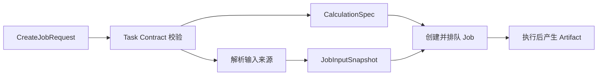

# Job 创建契约 v1

本文定义外部客户端创建计算 Job 时使用的稳定请求。它面向前端表单、Workflow、脚本和 AI 客户端，不暴露 SQLite、工作目录或 runner 实现。

## 为什么需要分层

计算任务同时包含四种变化速度不同的信息：

1. `profile` 是名称、说明和标签，只影响展示与检索。
2. `definition` 是科学计算定义，决定计算结果。
3. `inputs` 描述命名输入端口及其来源，提交时必须冻结。
4. `execution` 是资源和队列策略，不属于科学参数。

如果将这些字段放进同一个任意字典，前端无法生成可靠表单，Workflow 无法验证连接，AI 也无法知道可用参数。v1 因此采用以下总结构：

```text
CreateJobRequest
├── schemaVersion
├── profile
├── definition
│   ├── contract
│   ├── system
│   ├── parameters
│   └── outputs
├── inputs
│   └── ports
└── execution
    ├── priority
    ├── resources
    ├── retryPolicy
    └── queue
```

## 完整示例

统一入口为 `POST /jobs/calculations`：

```json
{
  "schemaVersion": 1,
  "profile": {
    "name": "MR-TADF GFN2-xTB 优化",
    "description": "优化基态几何结构",
    "tags": ["MR-TADF", "optimization"]
  },
  "definition": {
    "contract": {
      "kind": "geometry-optimization",
      "engine": "xtb",
      "version": 1
    },
    "system": {
      "charge": 0,
      "multiplicity": 1
    },
    "parameters": {
      "method": "gfn2-xtb",
      "optimizationLevel": "tight",
      "maxIterations": 500
    },
    "outputs": [
      {
        "type": "optimized-structure",
        "format": "sdf",
        "required": true
      },
      {
        "type": "trajectory",
        "format": "json",
        "required": true
      }
    ]
  },
  "inputs": {
    "ports": {
      "structure": {
        "type": "molecule-revision",
        "moleculeId": "mol-001",
        "revisionId": "rev-007"
      }
    }
  },
  "execution": {
    "priority": "normal",
    "resources": {
      "cores": 4,
      "memoryMb": 8192,
      "wallTimeSeconds": 3600
    }
  }
}
```

## 第一层：Profile

`profile` 只保存任务中心需要的可变展示信息：

| 字段 | 约束 | 是否影响计算结果 |
| --- | --- | --- |
| `name` | 必填，1–160 字符 | 否 |
| `description` | 可选，最多 2000 字符 | 否 |
| `tags` | 最多 32 个，自动去重 | 否 |

名称修改不应创建新的科学计算定义，也不能改变已经冻结的输入。

## 第二层：Definition

### Task Contract

`contract.kind` 表示“做什么”，`contract.engine` 表示“由谁计算”。二者不能合成 `xtb-optimization` 这类公共任务名。

当前注册组合：

| kind | engine | 内部 runner 类型 |
| --- | --- | --- |
| `geometry-optimization` | `xtb` | `xtb-optimization` |
| `transition-state-refinement` | `psi4` | `psi4-ts-refine` |
| `frequency-analysis` | `psi4` | `psi4-frequency` |
| `intrinsic-reaction-coordinate` | `psi4` | `psi4-irc` |

客户端通过 `GET /jobs/contracts` 读取每种组合的参数 JSON Schema 和输入端口，不应在页面中重复硬编码允许值。

### System

`system` 保存跨引擎一致的电荷和自旋多重度。它们不属于 xTB 或 Psi4 的私有参数。

### Parameters

`parameters` 在 JSON 中仍表现为对象，但后端会按 Task Contract 转成任务专用 Pydantic 模型。未知字段直接拒绝，不能穿透到 runner。

例如 xTB 当前只接受：

- `method: gfn2-xtb`
- `optimizationLevel`
- `maxIterations`
- 可选 `solvent`

### Outputs

`outputs` 是调用方希望得到的语义产物，不是后端文件路径。当前阶段将请求保存进 Job metadata；后续 runner 的结果提交阶段要据此检查必需产物是否齐全。

## 第三层：Inputs

每个任务通过有名称的端口消费输入。几何优化使用 `structure`，未来的过渡态初猜可以使用 `reactant`、`product` 和 `initialGuess`。

支持四种公共来源：

| type | 用途 | 提交时行为 |
| --- | --- | --- |
| `inline` | 小型临时结构或值 | 规范化并计算摘要 |
| `molecule-revision` | 正式分子版本 | 校验 Revision 并冻结其摘要 |
| `artifact` | 已有计算产物 | 校验来源 Job、格式和摘要 |
| `job-output` | 按 Job 和输出名称引用 | 解析为唯一 Artifact 后再冻结 |

正式前端流程应优先保存 `MoleculeRevision` 后再创建 Job。`inline` 主要用于脚本、兼容接口和小型临时任务。

## 第四层：Execution

`execution` 保存 CPU、内存、时限、优先级、重试策略和队列。它们可以影响运行成本，但不改变科学任务定义。

当前本地 runner 只消费其中可映射的核心数、内存和超时；优先级、队列和自动重试策略暂时只进入请求记录，等待调度器能力接入。

## 外部请求与内部快照

稳定边界如下：



公共 `kind + engine + parameters` 会适配为当前 runner 所需的 `CalculationSpec`。输入来源会解析成 `literal / molecule_revision / artifact` 三种不可变快照。执行器只读取 Spec 和 Snapshot，不读取原始 HTTP 请求。

## 当前阶段与下一步

当前 `POST /jobs/calculations` 在校验成功后直接创建并排队 Job，旧的 `/jobs/xtb/optimize` 和 `/jobs/psi4/*` 保持兼容。

下一阶段再单独实现持久化 Draft：

```text
CreateJobRequest -> JobDraft -> submit -> JobExecutionSnapshot
```

在 Draft 有独立存储和输入编辑语义以前，不能用 metadata 模拟草稿，也不能让复制操作偷偷启动计算。
