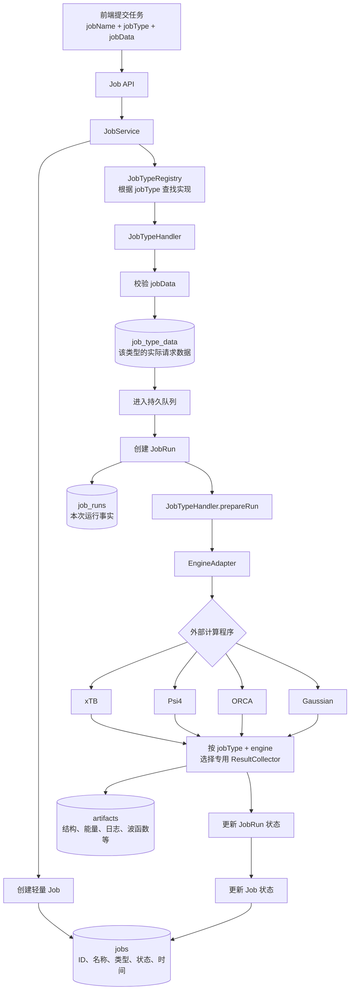
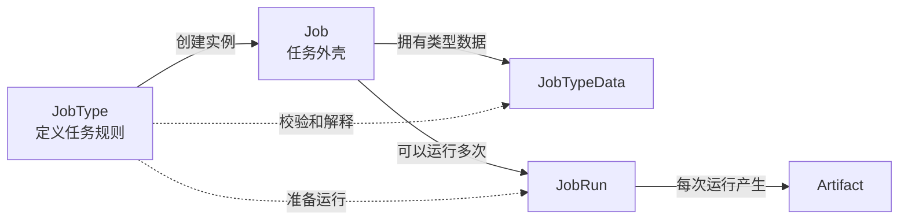
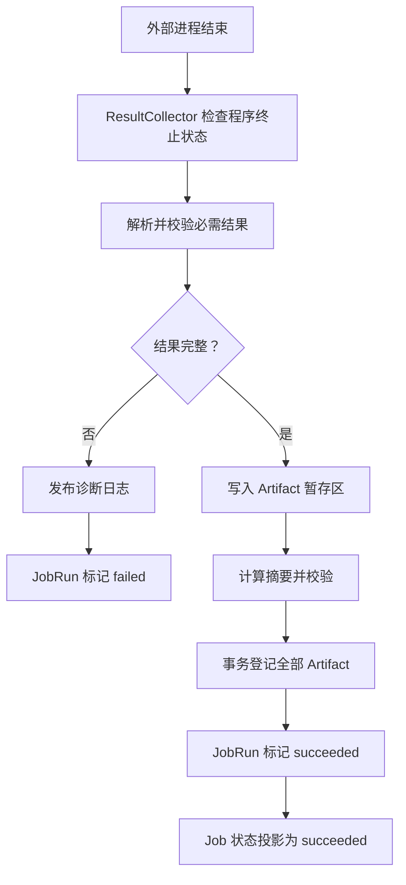

# Job Kernel 与 JobType 扩展边界

> 状态：架构决策，2026-07-18。本文描述目标边界；当前后端仍有 `CalculationSpec`、`JobInputSnapshot` 和旧创建契约需要逐步迁移，不能把本文误读为已经全部实现。

## 实施进度

- [x] 已建立 `jobs/job_types`、`JobTypeHandler` 和 `JobTypeRegistry`。
- [x] 现有 xTB 优化、Psi4 频率、TS、IRC 已作为四个独立 JobType 注册。
- [x] 持久 worker 已通过 Registry 分发，不再在 `execution.py` 中按任务类型写分支。
- [x] 已通过 schema 10 建立 `JobTypeData`、`JobRun` 与 `Artifact.runId`。
- [x] worker 领取 Job 时会在同一事务创建运行中的 `JobRun`；Job 进入终态时同步收口当前 Run。
- [x] xTB 优化已经拥有独立、版本化的 `XtbGeometryOptimizationCollector`，产物按 Run 幂等登记。
- [x] Psi4 频率、过渡态精修和 IRC 已分别使用独立 Collector；三类结果不再由 runner 中的任务分支解释。
- [x] 已提供 `JobTypeData` 与 `JobRun` 的只读 API，Artifact 响应携带所属 `runId`。
- [x] xTB 与 Psi4 的输入准备、外部进程启动和 Collector 编排已迁入各自 JobType Executor。
- [x] `xtb_runner.py` 与 `psi4_runner.py` 只保留领取任务、取消、错误映射和终态收口。
- [x] xTB 请求契约、XYZ/固定原子几何、命令构造与输出解析已迁入中立的 `engines/xtb`；HTTP Router 和 JobType 不再反向依赖。
- [x] `/optimize` 的同步子进程与流式轨迹轮询已迁入 `engines/xtb/execution.py`；Router 仅映射 HTTP 错误并编码 SSE。
- [x] 快捷同步优化与持久 Job 共用 `run_xtb_process`；输入文件、命令、日志和超时语义只有一个实现，Job 通过 `cancel_check` 保留协作取消。
- [x] `xtb-optimization@1` 已建立版本化任务数据模型；Executor 不再读取 `fixedAtomIds/maxSteps/optLevel` 等原始字典字段，只接收已校验的任务数据和引擎请求。
- [x] `psi4-frequency@1`、`psi4-ts-refine@1`、`psi4-irc@1` 已拥有三个独立请求模型；共享电子态与资源字段，但不会互相接受对方的专属参数。
- [x] 正式的 `create_calculation_job` 与 `create_calculation_draft` 会在写库前调用对应 JobType 的参数规范化器；无效参数不会留下 Job、Spec 或队列记录。
- [x] 创建阶段只校验并持久化 `engine + parameters`；冻结结构仍由输入快照保存，运行阶段才将二者合成为完整引擎请求。
- [x] xTB 与 Psi4 的运行准备优先读取规范化后的 `JobTypeData.parameters`，不再把原始 `CalculationSpec.payload` 作为新任务的运行真源；迁移数据保留显式回退。
- [x] worker 分发前校验持久化 `jobType + jobTypeVersion` 与注册实现完全一致，禁止用旧 Executor 猜测解释新版本数据。
- [x] 后端边界测试会拒绝 `jobs/job_types` 对 `routers` 的直接导入。
- [ ] 现有创建 API、`CalculationSpec` 和 `JobInputSnapshot` 仍处于兼容阶段。

### Schema 10 兼容规则

- 新任务创建时由已注册 JobType 校验并规范化数据，再同步写入 `job_type_data`；Kernel 不解释其中的化学字段。
- 新任务被 worker 领取时才创建 `job_runs`，排队但从未执行的任务没有伪造 Run。
- 旧数据库中已执行的任务回填一个 `migration-run-<jobId>`；无法唯一归属的历史同名 Artifact 保持 `run_id = NULL`，避免迁移丢数据。
- 新 Collector 使用 `(run_id, artifact.name)` 作为幂等键；相同内容重放返回已有 Artifact，不同内容则拒绝覆盖。

### 当前只读 API

```text
GET /jobs/{jobId}/type-data
GET /jobs/{jobId}/runs
GET /jobs/{jobId}/runs/{runId}
```

最后一个接口会校验 Run 确实属于路径中的 Job。Artifact 列表中的 `runId` 可用于把一次执行的输入、日志和科学结果关联起来。

### 当前 Collector 对应关系

```text
xtb-optimization  -> xtb-geometry-optimization@1
psi4-frequency    -> psi4-frequency@1
psi4-ts-refine    -> psi4-transition-state@1
psi4-irc          -> psi4-irc@1
```

Psi4 的三个 Collector 分别位于 `jobs/job_types/psi4/`。共享模块只负责文件登记、摘要和 Run 关联，不判断频率、过渡态或 IRC 的完成语义。

## 结论

`Job` 只作为任务索引和生命周期外壳，不理解分子结构、FCHK、计算方法、约束或分析选项。不同任务所需的数据、校验、执行准备和结果收集由版本化的 `JobType` 实现负责。

```ts
interface Job {
  jobId: string
  jobName: string
  jobType: string
  jobStatus: JobStatus
  jobCreatedAt: string
  jobUpdatedAt: string
}
```

`jobType` 直接引用不可变版本，例如：

```text
geometry-optimization@1
frequency-calculation@1
wavefunction-analysis@2
```

Job 顶层不再嵌入通用的 `jobInputs`、`jobParameters`、`jobExecution` 或 `jobArtifacts`。这些概念的**规则**由 JobType 定义；某次任务的类型数据、运行记录和实际产物分别持久化。

## 总体流程



## 四个核心边界



### Job

只回答：

- 任务是谁；
- 任务叫什么；
- 任务属于哪个版本化类型；
- 当前处于什么生命周期状态。

任务列表、搜索、权限和状态轮询只依赖 Job，不需要加载具体计算参数。

### JobTypeData

保存某个 JobType 的实际请求数据。Job Kernel 将其视为不透明数据，只有对应版本的 JobTypeHandler 可以校验和解释。

第一阶段可统一存入 `job_type_data.data_json`。当某个类型出现复杂检索、索引或大数据需求时，可迁移到该类型自己的表，不改变 Job 表。

### JobRun

记录一次实际运行。一个 Job 可以因为重试、恢复或更换运行资源产生多个 JobRun，因此不能在 Job 中保存单个 `jobExecution`。

### Artifact

记录一次 JobRun 实际产生的不可变数据，例如结构、能量、轨迹、日志、FCHK、Cube 或 Molden。Artifact 是独立实体，不作为数组嵌入 Job 表。

## JobType 插件协议

JobType 是领域概念，插件只是实现机制。公共 Job/API 使用 `jobType`，内部注册器返回对应实现。

```python
class JobTypeHandler(Protocol):
    job_type: str
    job_type_version: int

    def normalize_job_type_data(self, raw_data): ...
    def get_executor(self, engine_id): ...
    def get_result_collector(self, engine_id): ...
    def run(self, service, job_id, stop_check=None): ...
```

新增任务类型时，应增加独立 JobType 目录并注册，不修改 Job 核心、通用路由、队列或状态机。

当前内置实现采用下面的目录边界：

```text
engines/xtb/
├── contracts.py     # xTB 请求数据与约束校验
├── geometry.py      # XYZ I/O、原子 ID 恢复与固定原子对齐
├── command.py       # xTB CLI 参数和 xcontrol 构造
├── output.py        # 标准输出与优化轨迹解析
├── errors.py        # 稳定的引擎异常，不携带 HTTP 或 Job 状态
├── process.py       # 快捷请求与持久 Job 共用的阻塞进程入口
└── execution.py     # 同步结果解释与传输无关的流式事件

jobs/job_types/
├── xtb/
│   ├── request.py     # xtb-optimization@1 数据校验与引擎契约转换
│   ├── executor.py    # xTB 进程调用、取消检查与 Collector 编排
│   └── collector.py   # 优化结构、能量、轨迹和日志语义
└── psi4/
    ├── request.py     # 三种 Psi4 JobType 的独立 v1 模型与引擎投影
    ├── executor.py    # frequency / TS / IRC 的调用方式
    ├── common.py      # 只提供 Artifact 发布原语
    ├── frequency_collector.py
    ├── ts_collector.py
    └── irc_collector.py
```

依赖方向固定为：

```text
routers/optimize.py ─┐
                     ├─> engines/xtb
jobs/job_types/xtb ──┘
```

`engines/xtb` 不依赖 FastAPI、JobService 或 Artifact；它只表达 xTB 本身的输入、文件、命令和输出格式。Router 负责 HTTP/SSE，JobType 负责持久任务执行和语义结果发布，两者不能互相导入。

任务数据模型和引擎模型不能合并。任务结构需要保留 `charge` 等编辑图谱扩展字段，以便 Collector 恢复完整分子；xTB 引擎模型只接收元素、稳定原子 ID 和三维坐标。`request.py` 负责从前者显式投影到后者，防止引擎适配器无意丢失任务数据。

### 创建校验与运行校验

两次校验解决的是不同问题，不能合并：

```text
创建阶段
  engine + parameters
  -> JobTypeHandler.normalize_job_type_data
  -> canonical JobTypeData

运行阶段
  canonical parameters + frozen structure snapshot
  -> prepare_*_job_v1
  -> complete runtime request
  -> engine request
```

创建阶段禁止非法方法、越界步数和其他 JobType 的专属字段进入数据库。运行阶段还要验证冻结结构是否存在、原子坐标是否完整，以及 Artifact 摘要是否匹配。旧的通用 `create_job()` 仍允许保存历史 metadata，并在运行阶段校验；它只是兼容入口，不应作为新计算任务的正式创建方式。

## 结果收集是独立的大边界

“收集运行结果”不能实现成一个读取工作目录的通用函数。即使两个任务都调用同一个软件，它们需要识别的文件、完成条件和语义产物也可能完全不同；同一个 JobType 使用不同软件时，输出格式和错误模式也不同。

结果收集实现必须至少按下面的组合选择：

```text
(jobType, jobTypeVersion, engine, collectorVersion)
```

例如：

```text
geometry-optimization@1 + xtb
  -> XtbGeometryOptimizationCollector

geometry-optimization@1 + orca
  -> OrcaGeometryOptimizationCollector

frequency-calculation@1 + psi4
  -> Psi4FrequencyCollector

wavefunction-analysis@2 + multiwfn
  -> MultiwfnWavefunctionAnalysisCollector
```

每个 ResultCollector 独立负责：

1. 判断外部程序是否真正正常结束，不能只检查进程退出码；
2. 识别本任务要求的原始输出文件；
3. 解析能量、坐标、频率、轨道或分析表等语义数据；
4. 校验必需结果是否完整、格式是否正确、原子映射是否一致；
5. 把结果规范化为 JobType 声明的 Artifact；
6. 对 Artifact 字节计算摘要并原子发布；
7. 保存诊断日志和结构化错误；
8. 支持 worker 恢复后的幂等重放，不能重复登记同一结果。

通用基础设施只能提供：

- 工作目录访问；
- 文件摘要与内容寻址；
- Artifact 原子发布；
- 日志流读取；
- 临时文件清理；
- JobRun 状态事务；
- 统一错误包装。

它不能猜测哪个文件是优化结构、哪一行是最终能量、虚频是否符合任务要求，或某个 FCHK 是否完整。这些判断必须留在具体 ResultCollector。

### 结果提交顺序



在必需 Artifact 全部登记成功前，不得先把 JobRun 标记为 `succeeded`。结果解析失败也不能覆盖原始日志，以便后续修复 Collector 后重新收集。

## 示例：FCHK 波函数分析

```text
Job
  jobId: 20260718-a1b2c3d4
  jobName: GDG1223 波函数分析
  jobType: wavefunction-analysis@1
  jobStatus: succeeded

JobTypeData
  wavefunctionFileId: file-001
  analyses: [hirshfeld, mayer-bond-order]

JobRun
  runId: run-001
  engine: multiwfn
  runStatus: succeeded

Artifacts
  atomic-charges.json
  bond-orders.json
  stdout.log
```

该任务没有强制的“输入结构”或“理论方法”顶层字段。FCHK 是 JobTypeData 中的输入数据，由波函数分析 JobType 自己解释。

## 迁移原则

1. 先建立轻量 Job、JobTypeRegistry、JobTypeData、JobRun 和 ResultCollector 接口。
2. 将现有 xTB 优化迁移为第一个完整 JobType，并保留兼容 API。
3. 将 Psi4 频率、TS、IRC 分别迁移，禁止继续向通用 JobService 添加化学分支。
4. 每迁移一个任务，必须同时交付独立 Collector、失败样例和幂等测试。
5. 在所有现有任务迁移完成前，不删除旧 `CalculationSpec` 和 `JobInputSnapshot` 读取路径。
