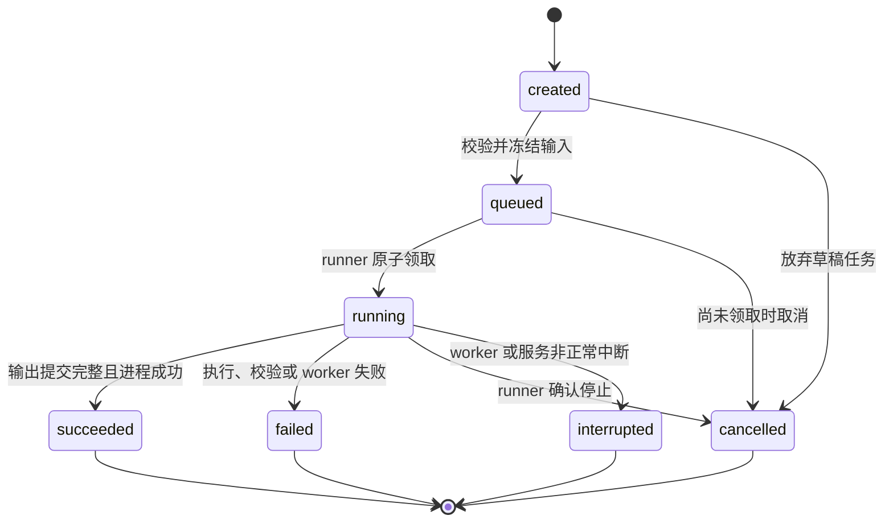
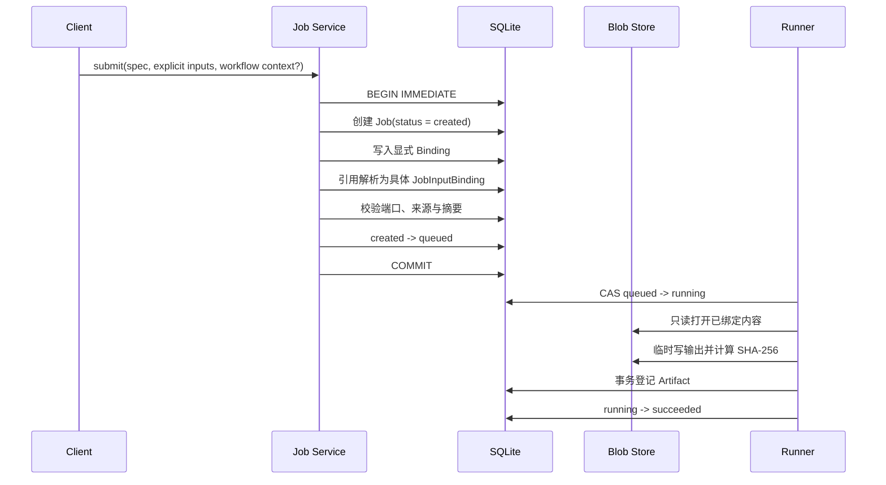
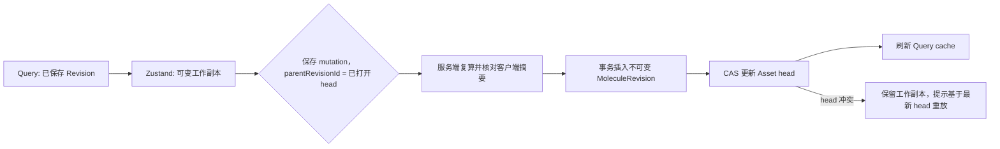
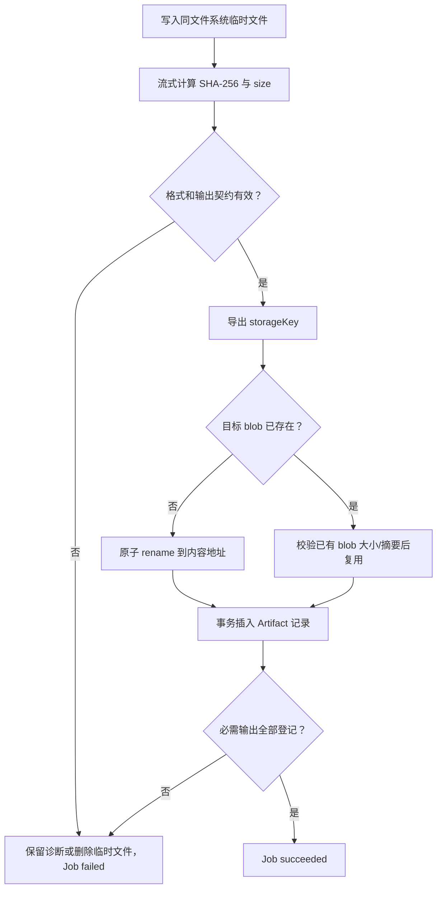

# 生命周期与状态机

## Job 状态

v1 只定义七个持久状态：`created`、`queued`、`running`、`succeeded`、`failed`、`cancelled`、`interrupted`。前端不得自行创造可持久状态；“正在取消”等瞬时 UI 文案由 mutation 状态表达。

### 状态语义和进入条件

| 状态 | 语义 | 进入条件 |
| --- | --- | --- |
| `created` | 尚不可被 runner 领取的预排队状态；schema 4 正式提交中仅在事务内存在 | Spec 已存在；正在写入并校验 Binding |
| `queued` | 输入已冻结，等待执行 | 必需端口完整；引用已解析；输入实体和摘要有效 |
| `running` | 一个 runner 已获得执行权 | `UPDATE ... WHERE status = 'queued'` 成功；记录 runner/lease 与 `startedAt` |
| `succeeded` | 计算成功且必需 Artifact 已原子登记 | 进程成功、输出验证通过、Artifact 元数据提交完成 |
| `failed` | 本次尝试确定失败 | 保存稳定 `errorCode` 和可读 `errorMessage`；不得自动回队 |
| `cancelled` | 用户取消已被服务端确认 | 未运行任务原子出队，或 runner 已确认子进程停止 |
| `interrupted` | 运行尝试因 worker/服务退出而失去连续性 | 启动恢复或迁移检测到无法证明仍在运行的旧 `running` Job |

### 迁移规则

- 所有迁移都由后端服务层校验，并以 compare-and-set 或事务更新；通用 `status = ?` 写接口不属于 v1 公共能力。
- 终态不可迁出。重试创建新 Job，并可设置 `supersedesJobId`，不能把失败 Job 改回 `queued`。
- `running -> cancelled` 必须在进程真正停止后发生。取消请求已发送但未确认时仍返回 `running`，前端以 mutation pending 表示。
- 能确认具体执行错误时进入 `failed`；无法取得 runner 结果、只能确认执行连续性丢失时进入 `interrupted`。两者重跑都创建新 Job。
- `succeeded` 需要必需输出已经内容寻址并登记。文件只写到任务目录但未登记，不算成功。
- 每次迁移用 `stateVersion + 1` 做并发保护，并追加 `JobStatusEvent`；事件与当前状态必须在同一事务提交。

### 当前实现差异

截至 2026-07-14：

- `JobService.create_job` 默认直接创建 `queued`，尚未使用 `created` 草稿阶段。
- `claim_queued_job` 已通过条件更新保证只有一个 runner 能执行 `queued -> running`。
- xTB runner 已实现 `running -> succeeded/failed`，超时和命令缺失会失败。
- 后端模型、wire projector 和 Query 终态判断均已识别 `interrupted`；schema 迁移会把遗留 `running` 映射为 `interrupted`，repository 初始化时会执行迁移器。
- 前端既有领域类型已识别 `created` 和 `cancelled`，但后端尚无取消 API、lease 恢复器或统一迁移守卫。
- `JobService.update_status` 已按状态图校验迁移并使用 CAS；旧值 `completed` 只在兼容输入和数据库迁移中归一为 `succeeded`。

## Workflow 引用解析与排队

Workflow 保存的 `JobInputReference` 是意图；Job 运行读取的是 `JobInputBinding`。两者必须在排队事务中完成解析，避免上游状态或文件在执行时漂移。

> **实施状态：schema 5 已启用。** xTB 的 literal/Revision/Artifact Binding、摘要校验和 Workflow 引用冻结已进入主路径。字段约束和示例见 [JobInputBinding 设计](./bindings.md)。

解析规则：

1. 正式提交在同一事务中创建 `created` Job、写入 Binding 并转为 `queued`；失败时不保留半绑定 Job。
2. `sourceKind = artifact` 时，来源 Job 必须为 `succeeded`。有 `sourceArtifactId` 时校验其归属；否则 `sourceName` 必须唯一命中一个 Artifact。两种方式都要校验 media type/format。
3. `sourceKind = input` 时，复制来源 Job 已冻结绑定中的 literal、Revision ID 或 Artifact ID，不复制可变路径。
4. 显式绑定与 Workflow 引用同时指向同一端口时拒绝请求，不使用隐式优先级。
5. 解析结果保存 `resolvedFromReferenceId`；之后编辑 Workflow 不影响已冻结绑定。
6. 所有端口校验通过后才整体提交，禁止部分绑定后进入 `queued`。

## Molecule 保存流程

编辑器中的工作副本是本地可变状态；只有保存成功后才成为 Revision。

> **实施状态：主链路已实现。** schema 6、repository/service/HTTP API、服务端摘要复算和 CAS 已完成；TanStack Query mutation 已连接编辑器工作副本。xTB 提交会先冻结当前 Revision，再创建只引用该 Revision 的 Job。

- 规范序列化必须递归排序对象键，并按稳定 ID 归一化原子、键及无向键端点；数组和数值编码规则必须固定。`contentHash` 包含坐标，`topologyFingerprint` 忽略坐标。客户端摘要只用于预检，服务端必须复算。
- 创建 Revision 与更新 `head_revision_id/version` 在一个数据库事务中完成；Revision 的规范结构直接保存在数据库中，格式化导出另建 Artifact。
- head 冲突必须回滚本次 Revision 插入，不能覆盖对方 Revision，也不能向客户端报告保存成功；显式分支是后续独立命令。
- 从计算结果“载入结构”先验证原子 ID/元素映射，再创建新 Revision；不得修改产生该结果的 Artifact。
- 保存 API、错误语义和 Job 冻结边界见 [MoleculeAsset / MoleculeRevision 契约](./molecule-assets.md)。
- xTB 结果载入编辑器后，工作副本会暂存 `derivedFromJobId`、`derivedFromArtifactId` 和 `sourceRevisionId`；下一次保存把它们写入新 Revision metadata，保存成功后清除暂存来源。

## Artifact 提交流程

Artifact 的文件名和 role 提供语义，摘要提供内容身份，Artifact ID 提供 provenance 身份。三者不可互换。日志即使内容重复也保留独立 Artifact 记录；底层 blob 可以去重。

## 查询与刷新

- Job 列表和详情在非终态时可轮询；终态停止轮询。当前前端周期为 2 秒。
- mutation 成功后，先用服务端响应更新对应 detail/list cache，再失效可能受影响的 Workflow、Artifact 或 Molecule query。
- Zustand 中的 `selectedJobId` 不因 Query 重取而重置；如果实体被删除或无权访问，由视图根据 Query 结果清空选择。
- Artifact 解析结果的 query key 必须包含 `artifactId`，必要时再包含 `sha256`；不能只用文件名。
