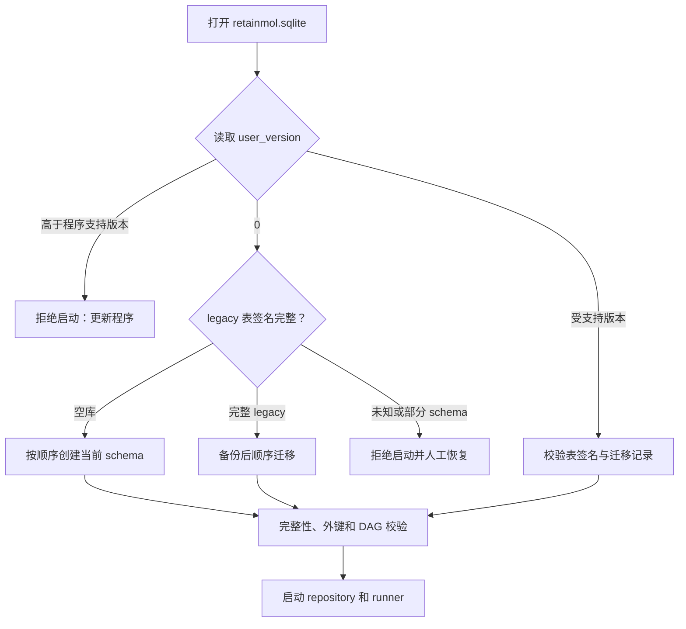
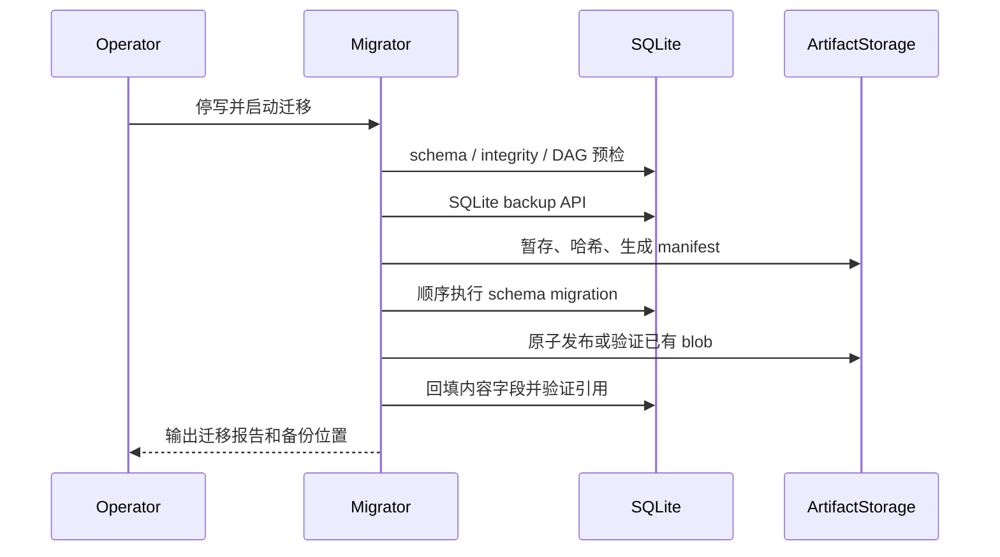

# 产品数据模型 v1 的 SQLite 迁移

本文描述产品数据模型 v1 的迁移策略。产品版本与 SQLite `user_version` 是两套编号：当前工作区迁移器支持到 schema **6**，但工作区实现状态不等同于正式发布状态。不能把“产品 v1”误写成 `PRAGMA user_version = 1`。

## 当前策略

`JobRepository._initialize()` 已只调用 `software/backend/jobs/migrations.py`，运行主路径不再维护第二套内联 DDL。本文按当前工作区 schema 6 结构描述迁移；具体能力仍按各节的实施状态判定。

迁移器当前行为：

| SQLite schema | 行为 |
| --- | --- |
| 0 -> 1 | 创建/登记 legacy 六张表和索引，兼容已有 `user_version = 0` 数据库 |
| 1 -> 2 | 新增 `calculation_specs`、`molecule_assets`、`molecule_revisions`、`job_status_events`，并扩展 Job、Artifact 和输入引用字段 |
| 2 -> 3 | 为 `CalculationSpec` 增加 `schema_version` 和引擎中立的 `payload_json` |
| 3 -> 4 | 增加 `job_input_bindings` 及三选一来源约束，不删除 legacy `job_inputs` |
| 4 -> 5 | 物化 Asset head/version 与 Revision schema/拓扑摘要，回填 legacy 摘要并安装 Revision 不可变和 head 归属触发器 |
| 5 -> 6 | 为不可变 Molecule Revision 增加 provenance `metadata_json`，旧行默认 `{}` |

每个版本在 SQLite savepoint 内执行，成功后设置 `PRAGMA user_version`；高于程序支持版本时拒绝迁移。schema 2 会把 `completed` 映射为 `succeeded`，把启动时遗留的 `running` 映射为 `interrupted`，并把旧 `error` 回填到 `error_message`；schema 3 补齐版本化 CalculationSpec 的 `schema_version` 与 `payload_json`。

当前仍有明确缺口：

- 迁移器没有 schema 签名校验、SQLite backup、磁盘空间预检或迁移审计表；
- `JobInputBinding` 已落表，新 xTB 提交只写冻结 Binding；`job_inputs` 仅保留 legacy 读取兼容；
- schema 2 只把 `artifacts.path` 复制到 `storage_key`，没有读取文件并回填 `sha256`/`byte_size`；
- 新 Artifact 已通过 `JobService` 发布到 `ArtifactStorage`，但旧 Artifact 尚未批量搬迁和校验；
- schema 5 已完成 Molecule Asset/Revision 的 head/version、双摘要、不可变触发器、service/API 和 `molecule_revision` xTB 主路径；schema 6 增加 Revision provenance metadata。编辑器保存、xTB 提交冻结和优化结果来源回写已接线，更完善的旧数据迁移审计仍待完成。

**schema 4** 引入 `job_input_bindings` 与 create → bind → queue；**schema 5** 完成 Revision 不可变与 xTB Revision 输入所需存储约束；**schema 6** 增加不可变来源 metadata。详细契约见 [JobInputBinding 设计](./bindings.md)。

因此当前工作区以 schema 6 作为 repository 启动目标。旧 Artifact 离线回填和迁移审计/备份尚未完成，仍不能据此宣称产品数据模型 v1 正式发布。

## v1 完成标准

已发布的 migration 1 和 2 不得重写。剩余结构必须使用下一个可用整数版本追加迁移，至少达到以下逻辑约束：

| 表 | v1 关键约束 |
| --- | --- |
| `molecule_assets` | `head_revision_id` 必须指向本 Asset 的 Revision；保存时同时校验 expected head 与 expected version |
| `molecule_revisions` | `structure_json`、双摘要和父版本创建后不可更新；数据库触发器禁止 UPDATE/DELETE |
| `calculation_specs` | 规范参数和 schema 版本创建后不可更新 |
| `jobs` | 引用 Spec；状态、`state_version` 和时间戳按状态机更新 |
| `job_status_events` | `UNIQUE(job_id, state_version)`，只追加 |
| `job_input_bindings` | `UNIQUE(job_id, input_name)`；literal/Revision/Artifact 来源异或 |
| `artifacts` | `sha256`、`byte_size`、规范 `storage_key`；内容不可覆盖 |
| `workflows` | 增加乐观并发 `version` |
| `workflow_jobs` | 保留成员与展示位置 |
| `job_input_references` | 源/目标属于 Workflow，目标端口唯一，整图无环 |
| `schema_migrations` | 记录版本、脚本校验和、应用版本和完成时间 |

`PRAGMA user_version` 用于快速选择迁移，`schema_migrations` 用于审计。两者不一致、迁移校验和改变或 schema 高于程序支持版本时必须拒绝启动。

## 启动判定

不得仅因 `user_version = 0` 就假设数据库为空；所有现有 legacy 数据库也会返回 0。接入迁移器后，repository 的内联建表脚本必须删除或改为唯一的 migration 入口，不能并行维护两套 DDL。

## legacy 数据映射

| legacy 数据 | v1 处理 |
| --- | --- |
| `jobs.task_type`、`metadata_json.request` | 每个 legacy Job 建立一个不可变 CalculationSpec；迁移期不做跨 Job 推测去重 |
| `jobs.status = completed` | 映射为 `succeeded` |
| 迁移时的 `jobs.status = running` | 映射为终态 `interrupted`，因为进程连续性无法证明 |
| 其他未知 Job 状态 | 停止自动迁移并要求显式映射，不能默认当作失败 |
| `job_inputs` | 转成 `sourceKind = literal` 的 JobInputBinding；不从任意 JSON 猜测 Revision/Artifact |
| `artifacts.path` | 在 `<data_root>/tasks/<jobId>/<path>` 内安全解析，读取字节并发布到 ArtifactStorage，回填 `sha256`、`byte_size` 和规范 `storage_key` |
| 缺失 Artifact 文件 | 保留记录和 legacy path，标为 `missing`；不得伪造摘要，依赖它的新 Job 不能排队 |
| `workflows` / `workflow_jobs` | 原样保留 ID、时间、成员和 position；Workflow `version` 初始化为 1 |
| `job_input_references` | 保留 ID 和边；重新校验成员、目标端口唯一与 DAG，失败则中止迁移 |
| metadata 中嵌入的 molecule | 原样保留，不自动创建 Asset/Revision，避免错误合并用户资产 |

迁移不重新运行计算，也不根据文件名推断化学语义。schema 5 对可解析的 legacy Molecule 按当前规范回填摘要；无法解析的旧 JSON 使用带命名空间的迁移完整性摘要以保持行可读，但不能把它误当作已验证的规范 Molecule 提交给新计算。用户重新保存时必须经 service 校验并创建新 Revision。详细边界见 [MoleculeAsset / MoleculeRevision 契约](./molecule-assets.md)。

## 执行流程

文件系统发布不能随 SQLite 事务回滚，迁移必须采用可恢复的两阶段流程：

1. **停写与预检**：停止 runner，取得迁移锁；执行 `PRAGMA integrity_check`、外键检查、schema 签名、DAG 和磁盘空间检查。
2. **备份**：使用 SQLite backup API 生成带时间戳备份；记录应用版本和备份 SHA-256。不能复制正在写入的裸数据库文件。
3. **暂存内容**：通过 `ArtifactStorage` 的同等校验逻辑读取 legacy Artifact，在迁移 manifest 中记录原路径、摘要、大小和目标 key；不改旧记录。
4. **数据库迁移**：按整数版本逐个执行；在事务中建表、转换数据、校验计数/外键，写 `schema_migrations` 并更新 `user_version`。
5. **发布与回填**：原子发布内容寻址文件，已有 blob 先校验再复用；事务回填 Artifact 内容字段和完整性状态。
6. **验证**：再次执行完整性、外键、DAG、行数、摘要抽检和 API smoke test，成功后才启动 runner。
7. **保留 legacy 文件**：兼容窗口结束前不删除旧任务目录；所有新写入只使用 v1 表和内容寻址存储。

迁移必须可重入：已完成版本不重复执行，暂存 manifest 可从最后一个已验证文件续跑。迁移日志、metadata、manifest 和备份说明不得包含密码、令牌或私钥。

## 兼容窗口

兼容窗口从**首个包含 v1 完整读写和自动迁移能力的正式发布日**开始，到以下条件都满足后结束：

1. 已经过至少 **90 个自然日**；
2. 已发布至少 **两个后续正式版本**，补丁或热修版本不计。

例如正式发布日若为 2026-07-14，最早结束日是 2026-10-12；若届时不足两个后续正式版本，窗口继续延长。实际日期必须写入发布说明，不能把此示例当成既定发布日期。

### 窗口内保证

- 保留现有 Job、Artifact、Workflow 和 Reference ID，不要求客户端解析新 ID 格式。
- API 继续接受当前 camelCase 请求，并投影现有 `taskType`、`inputs`、`error` 等旧字段。
- legacy `job.json` 可读取；新快照带独立 `schemaVersion`，SQLite 始终是真源。
- 旧 Artifact path 仅作读取回退和审计；新 Artifact 只写内容寻址存储，不双写旧布局。
- legacy `job_inputs` 通过适配器表现为 Binding；新代码不得继续写 legacy 表。
- 前端 wire projector 同时接受当前 snake_case/camelCase 和规范化状态，Zustand 不承担 DTO 兼容。

### 不保证的兼容性

- 数据库升级是单向的。旧后端不保证能打开新 schema；回滚必须恢复升级前数据库备份和匹配的任务目录快照。
- 兼容窗口针对 API 和旧数据读取，不承诺旧二进制与新 schema 双向写入。
- 未知状态、损坏数据库、路径越界或缺失文件不会静默修复；迁移停止或显式标记完整性错误。

窗口结束必须作为独立 breaking change：先统计旧 DTO 和 path 回退使用量并发布移除通知，再删除适配器。满足备份保留策略后才可清理 legacy 表、旧任务目录副本和 path 回退字段；内容寻址 blob 与 Artifact provenance 永久保留。

## 回滚与验收

数据库迁移提交前失败时删除未引用暂存文件并继续使用旧库；提交后、内容回填完成前失败时保持维护模式并按 manifest 续跑。验证失败则从 backup API 生成的备份恢复，不用反向 SQL 覆盖原库。

上线必须满足：

- `user_version` 等于程序支持版本，所有迁移记录及脚本校验和匹配；
- Job、Workflow、成员、引用和 Artifact 计数符合迁移报告；
- 可用 Artifact 的 `sha256`、`byte_size` 与 blob 一致，缺失内容显式标记；
- 外键、DAG 和 `PRAGMA integrity_check` 全部通过；
- 相同字节可共享 blob，但每个 Artifact 的 ID、Job provenance 和 metadata 保留；
- 新 API smoke test 通过，兼容窗口内的旧 DTO 仍可读取。
