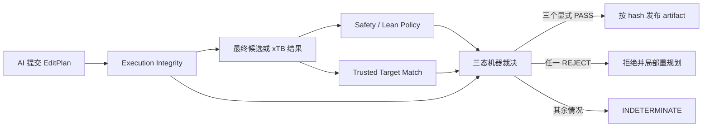

# AI 三维建模的对抗式形式化循环

## 本轮适用范围

第一版只处理具有可信 expected graph 和 GeometryPolicy 的普通共价 benchmark。涉及金属配位、
完整立体标记、同位素或没有可信目标图的图片任务，结果必须是 `INDETERMINATE`，不能降级为
“大概通过”。

## 三个独立裁决轴

- `Execution Integrity`：规范化计划、执行回执和产物哈希一致。
- `Safety / Formal Policy`：完整化学图、锚点、全部成键距离、刚性组和朝向满足可信 policy。
- `Trusted Target Match`：benchmark 的隐藏目标图与最终候选匹配；它不能从候选反推生成。

任何坐标修改都会使旧的安全 verdict 失效。xTB 后的文件才是最终 artifact，必须重新解析、
重新验证并绑定新的 SHA-256。

## 多角色博弈

1. Proposer 只看公开任务并提交 `EditPlan`。
2. Trusted orchestrator 在 proposer 运行前封存 expected graph、policy、版本和哈希。
3. Executor 执行计划，机器检查执行完整性。
4. Attacker 只能提交可复验挑战，例如锚点移动、键长越界、图变化或碰撞。
5. Challenge verifier 独立复验，不接受 attacker 自定义阈值。
6. Judge 只解释匿名机器证据；不能覆盖机器状态。
7. 连续三轮相同失败指纹时停止，避免把评估器当作隐藏答案 oracle。

## 明确不做的事

- 不允许模型提交 policy、scale、Lean 源码或“证明已通过”的声明。
- 不从 observed candidate 自动生成目标图、键长范围、刚性组或朝向。
- 不使用 LLM 投票或加权总分替代三轴显式 PASS。
- 不把工具缺失、超时和未知 schema 记作候选错误；它们属于 `INDETERMINATE`。
- 当前不把 verified artifact 直接写入实时 molecule store。

## 下一轮

下一轮重点是独立 `ExpectedEffect` 编译器和最终 artifact formal bridge。前者从规范化 EditPlan、
模板 manifest 和 command semantics 生成预期变化；builder receipt 只是待核验 witness，不能定义
什么变化是正确的。
