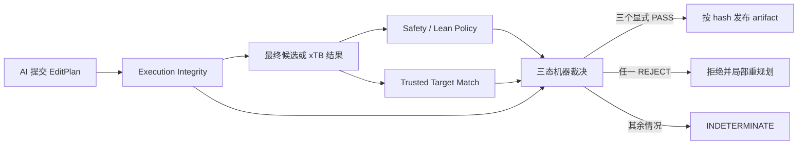

# AI 三维建模的对抗式形式化循环

## 本轮适用范围

当前 PASS 域只处理具有可信 ExpectedEffect 和 GeometryIntent 的普通共价 benchmark。涉及金属配位、
完整立体标记、同位素或没有可信目标图的图片任务，结果必须是 `INDETERMINATE`，不能降级为
“大概通过”。

## 三个独立裁决轴

- `Execution Integrity`：规范化计划、执行回执和产物哈希一致。
- `Safety / Formal Policy`：完整化学图、锚点、全部成键距离、刚性组和朝向满足可信 policy。
- `Trusted Target Match`：benchmark 的隐藏目标图与最终候选匹配；它不能从候选反推生成。

任何坐标修改都会使旧的安全 verdict 失效。xTB 后的文件才是最终 artifact，必须重新解析、
重新验证并绑定新的 SHA-256。

## 多角色博弈

1. Proposer 只看公开任务并提交 `EditPlan`。
2. Trusted orchestrator 冻结初始结构、ExpectedEffect、enforced plan 和可选 run spec；生产 gate
   从这些证据生成 GeometryIntent，数值 policy 只能由 Lean 编译。
3. Executor 执行计划，机器检查执行完整性。
4. Attacker 只能提交可复验挑战，例如锚点移动、键长越界、图变化或碰撞。
5. Challenge verifier 独立复验，不接受 attacker 自定义阈值。
6. Judge 只解释匿名机器证据；不能覆盖机器状态。
7. 连续三轮相同失败指纹时停止，避免把评估器当作隐藏答案 oracle。

## 明确不做的事

- 不允许模型提交 policy、scale、Lean 源码或“证明已通过”的声明。
- 不从 observed candidate 自动生成目标图、键长范围、刚性组或朝向。
- 不使用 LLM 投票或加权总分替代三轴显式 PASS。
- 不把工具缺失、超时和未知 schema 记作候选错误；它们属于 `INDETERMINATE`。
- 当前不把 verified artifact 直接写入实时 molecule store。

## 当前落地状态

第二轮已经加入独立 `ExpectedEffect V1`、最终 SDF bridge、统一 verification context 和三轴发布门。
生产 builder 的回执仍只是 witness；预期变化由不依赖 builder command 的纯语义编译器产生。

当前可信范围故意很窄：

- 只形式化七种确定性原子/键命令；高阶模板和几何命令返回 `INDETERMINATE`；
- 只允许中性闭壳层 H/B/C/N/O/F 普通共价结构；
- 只接受单、双、三键和显式 Kekule 图；
- 不接受芳香标记、同位素、立体标记、金属配位或断开的多组分结构；
- xTB 坐标回传只有在可执行文件 SHA-256 与运行时信任配置一致，输入 SDF 与 input XYZ 逐行一致，
  output XYZ 经固定锚点投影可重建最终 SDF，并且行顺序契约与摘要链完整时，才可通过 safety 轴。
- 固定锚点来自 run spec 与 enforced plan 约束的并集；刚性组和朝向原子组来自冻结 run spec，
  数值阈值不进入调用方 schema。初始/expected/builder 的源坐标在量化前精确绑定，Lean 再对
  整数化后的有限意图求值；严格桥对原子、命令、列表和整数范围设置预算。

全部尝试继续进入普通 history；只有 evaluator 与三轴验证都显式 PASS，且归档中的目标参考 SDF、
评估器源码、不可变 run manifest、完整 geometry request 和全部上游证据重新计算摘要后仍一致的运行，
才进入 `history/verified/index.json`；索引发布由文件锁串行化。
