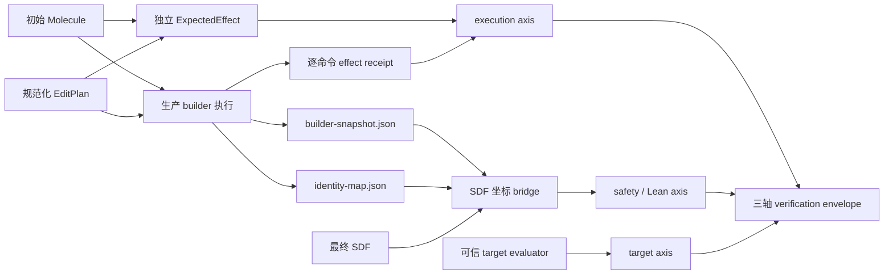

# AI 建模最终产物验证 V2-V4

## 为什么要有第二条独立链

生产 builder 可以执行 EditPlan，但“执行成功”不等于“执行了计划要求的变化”。如果预期变化和
实际变化都由同一套 builder 代码生成，两边会共享同一个缺陷。因此 V2 同时保存两条链：

1. `ExpectedEffect` 用独立纯函数从初始 Molecule 与 EditPlan 推导逐命令变化；
2. 生产 builder 每执行一个命令前后都生成实际 effect receipt；
3. 比较器检查命令顺序、稳定 ID、前后快照、原子变化、键变化和最终快照；
4. 最终 SDF 只能搬运坐标，不能重新定义图、键级或原子身份。

## 证据流



## 运行管线边界

一次建模尝试按以下阶段执行，各阶段只接收显式输入并产出可归档证据：

1. `prepare`：原子化分配 run 目录，冻结初始 Molecule、EditPlan、目标证据与运行参数；
2. `execute`：生产 builder 执行冻结后的输入，生成候选结构和逐命令执行证据；
3. `refine`：可选的构象生成与 xTB 精修，只在临时文件中工作；
4. `verify`：检查执行输入摘要、证据完整性及三轴最终产物 envelope；
5. `record`：原子化写入 `run.json` 与人工可读报告，再按发布规则进入历史索引。

`run-manifest.json` V2 额外绑定 `inputs/initial-molecule.json` 与 `run-spec.json` 的 SHA-256。
因此任务目录在运行中被修改，也不会改变已经开始的尝试。执行回执的 `inputSha256` 必须与冻结输入
一致，否则验证直接 REJECT。精修后的 SDF 只有在坐标来源、摘要和目标评估全部完成后才从 staging
原子化发布为 `candidate.sdf`；失败时保留原始候选与诊断，不能留下半完成的最终候选。

`runner.py` 仅负责阶段编排与旧调用接口兼容。准备、精修、验证、记录分别位于
`run_preparation.py`、`refinement_stage.py`、`verification_stage.py` 和 `run_recording.py`，后续扩展
某一算法时不应重新把化学策略、文件发布和验证策略混回 orchestrator。

## ExpectedEffect V2 范围

| 状态 | 命令 |
| --- | --- |
| 可独立推导 | `atom.add`、`atom.replace`、`atom.remove`、`atom.move` |
| 可独立推导 | `bond.add`、`bond.remove`、`bond.setOrder` |
| 暂不推导 | 电荷、自由基、加 H、模板连接、桥接、并环、键长/键角/二面角和刚体旋转 |

暂不推导不是失败，而是 `unsupported-effect-semantics`。它必须产生 `INDETERMINATE`，避免将尚未
形式化的高阶语义伪装成 PASS。

### 2026-09-20 手性快照修复

`ExpectedEffect.schemaVersion` 已升为 2，规范摘要前缀改为 `canonical-v3-sha256-`。
原子快照包含 `chirality`，键快照包含 `wedge` 与 `ez`；有楔形的键保留端点顺序，
因为 `atomId1` 是窄端。普通无向键仍规范化端点顺序，原子/键数组重排不改变摘要。
旧回执不得和 V2 混用；Python 可读取 V1 历史证据，但 V1 不提供新增的手性字段校验。
Node 执行器从包导出的常量读取回执版本，避免两端各自硬编码。

独立效果推导仍不调用生产 builder；两者共用无 UI 依赖的 CIP 感知策略来更新**已指定**的
原子手性。此项比较能发现标记变化，并不扩展下述 Lean/最终产物 PASS 域到立体化学。
实现与验证边界见 [手性正确性](../stereochemistry.md)。

## SDF bridge 规则

- `builder-snapshot.json` 是图和电子属性的权威来源；
- `identity-map.json` 固定 SDF 的 1-based 行号与稳定 atomId/bondId；
- SDF 必须只有一个完整记录，原子行数、元素顺序、端点和键级必须逐项一致；
- RDKit 以 `sanitize=False` 读取，防止把显式 Kekule 单双键自动改写成芳香表示；
- bridge 只把最终坐标写回稳定 ID 快照；任何图变化都直接 REJECT。

## 三轴与统一上下文

三个轴都绑定相同的：

- final artifact SHA-256；
- policy SHA-256；
- verification context SHA-256。

context 还包含 builder snapshot、identity map、最终 SDF、执行回执、ExpectedEffect、enforced plan
和坐标 transport evidence 的哈希。只要其中一份证据变化，旧 verdict 就不能用于发布。

最终状态规则固定为：任一轴 REJECT 则 REJECT；三个轴全部显式 PASS 才 PASS；其他情况一律
INDETERMINATE。验证工具缺失、超时、异常、证据文件缺失也属于 INDETERMINATE，不能把基础设施
故障算到候选分子头上。

## 当前 PASS 域

V2 当前只允许中性、闭壳层、单组分 H/B/C/N/O/F 分子，键型限单/双/三键并采用显式 Kekule
表示。不在该域内的同位素、立体标记、芳香标记、金属配位和其他元素均为 INDETERMINATE。

xTB 坐标回传还要求运行时设置的可信可执行文件 SHA-256 与实际二进制哈希一致。每次运行会归档
`xtb-input.sdf`、`xtb-input.xyz` 和 `xtb-output.xyz`，并在坐标收据中同时绑定这些文件、最终 SDF、
稳定 atomId 行映射、`xtb-preserves-input-row-order-v1` 契约和固定锚点框架投影步骤。验证器会重新解析
SDF/XYZ，逐行确认输入 SDF 与 input XYZ 一致，并重放 output XYZ 的固定锚点投影，确认它确实生成最终
SDF，而不是只比较几份彼此自洽但语义无关的摘要。没有配置可信
哈希、归档缺失或任一摘要不一致时，xTB 结果可以保存和人工检查，但不能进入 verified artifact 索引。

这里的精确边界是：XYZ 本身没有 atomId，因此系统不能仅凭元素和坐标重新辨认两个同元素原子。
当前证明依赖已固定哈希的 xTB 二进制遵守“输出原子行顺序与输入一致”的适配器契约；如果未来换用
不能保证行顺序的程序，必须增加显式 atom mapping，不能沿用这个 PASS 路径。

Lean 同样采用运行时信任配置，而且分别校验启动器与实际编译器，不能只信任 PATH 中的命令名：

```bash
export RETAINMOL_TRUSTED_LEAN_LAUNCHER_SHA256="$(shasum -a 256 "$(command -v lake)" | awk '{print $1}')"
export RETAINMOL_TRUSTED_LEAN_SHA256="$(shasum -a 256 "$(lake env which lean)" | awk '{print $1}')"
```

这些值属于部署信任策略，不写入仓库。缺失或不匹配时，Lean 轴必须是 `INDETERMINATE`。
V4 最终产物 gate 不再由 Python 生成调用方可见的距离阈值。它从 ExpectedEffect、enforced plan、
冻结初始结构和 builder 快照生成 GeometryIntent，Lean 根据 expected 编译成键距离、保护锚点、
朝向和刚性约束。源快照在 0.001 Å 量化前做精确绑定，因此亚量化差异不能伪装成同一输入。

## 归档规则

- `history/index.json` 保存所有尝试，包括 REJECT 和 INDETERMINATE；
- `history/verified/index.json` 只收录 evaluator PASS 且三轴 verification PASS 的运行；
- 每个可发布运行归档实际 `target-reference.sdf` 与 `target-evaluator.py`，不只保存两份摘要字符串；
- 每次重建 verified index 都重新计算全部输入、transport、目标参考、评估器、完整 geometry request 和
  verification 文件摘要；`runId`、`createdAt`、case、Git/执行器信息由不可变 `run-manifest.json` 绑定，
  manifest 中的编辑计划摘要也必须与归档的 `edit-plan.json` 完全一致；
- 归档与 verified index 重建持有同一文件锁，避免并发运行用旧快照覆盖较新的失效结果；
- xTB 含重复元素时，必须由至少三个非共线固定原子建立坐标框架；固定原子在原始输出、其余原子在
  投影输出中都必须保留唯一的同元素 Voronoi 身份区域，否则 atomId 连续性判为不可证明；
- 失败记录不覆盖、不删除，便于后续 subagent 对相同失败指纹进行反驳和复验。

## 证明边界

Lean 证明的是“给定有限整数化 policy，候选满足这些不变量”。它不证明量子化学正确性，不证明
二维图片识别无误，也不证明当前七种命令之外的高阶编辑语义。扩域必须先增加独立语义、反例和
攻击测试，再允许进入 PASS。

V4 publication gate 会从归档证据重建 GeometryIntent，并核对 run spec、manifest 和完整请求摘要。
当前仍未闭合的信任边界包括：runtime receipt 投影与 Lean 基础命令的逐字段等价定理、Lean proof
mode 与源码闭包认证，以及高阶模板/并环/关节命令的关系语义。它们完成前，
不能把现有 PASS 宣称为“AI 已经理解三维结构”或“结果具备完整数学正确性”；现有结论仅覆盖文档
明确列出的离散几何与证据一致性不变量。
