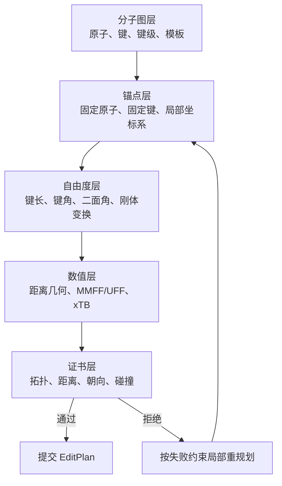

# 用数学证书约束 AI 三维建模

## 问题定义

AI 从二维图片生成三维分子时，真正困难的不是输出三个坐标，而是同时保持：

- 分子图正确；
- 母核、手性中心和刚性构象不被破坏；
- 模板连接、并环和旋转具有明确的几何语义；
- 每次局部修改都能解释、检查和回滚。

要求模型“想象完整三维空间”不可测试，也无法定位错误。RetainMol 改用“关系规划 + 数值求解
+ 形式化验证”：模型只选择锚点、模板、连接关系和允许变化的自由度，三维算法求坐标，
验证器检查结果。

## 五层表示



这意味着模型无需记住某个片段旋转后所有原子的世界坐标。它只需说明：

- 哪些 B/N 原子必须固定；
- 新片段连接到哪个原子或哪条边；
- 哪个片段作为刚体；
- 哪些键长、角度和朝向必须满足区间；
- 哪些单键二面角允许搜索。

## 与现有 RetainMol 的分工

| 层 | 输入 | 输出 | 权威职责 |
| --- | --- | --- | --- |
| 多模态 provider | 图片、文本、当前选择 | 图提案与 `EditPlan` | 识别和规划 |
| `mol-viewer/modeling` | `EditPlan` | dry-run Molecule | 命令语义、价态和事务 |
| 几何/优化器 | 初始 Molecule、约束 | 候选坐标 | 连续数值求解 |
| Lean 验证器 | expected 快照、最终候选、可信 policy | issue 列表 | 精确离散与几何不变量 |
| xTB/Psi4 等 | 已验证结构 | 能量、力、波函数产物 | 计算化学结果 |

Lean 必须位于 builder dry-run 之后。它不允许绕过现有命令直接制造 SDF，也不把通用价态
判断复制成另一套规则。

## Policy 设计

policy 不是“证明这个分子绝对正确”，而是由可信编排器声明本轮编辑必须保持的性质。AI
不能提交或删减 policy。生产 loop 先把下面的意图写入 `run-spec.json` schema v2，再由
`run-manifest.json` 的 `runSpecSha256` 绑定；最终 gate 只能从这份冻结文件重建 policy：

```json
{
  "schemaVersion": 1,
  "policyId": "anchored-core-v2",
  "fixedAtomIds": ["B:core", "N:left", "N:right"],
  "orientationChecks": [{
    "atomIds": ["B:core", "N:left", "N:right", "C:center"],
    "minAbsVolume6": 100000000
  }],
  "rigidAtomGroups": [{
    "atomIds": ["B:core", "N:left", "N:right", "C:center"],
    "maxSquaredDistanceDelta": 1000
  }]
}
```

全部成键距离区间由可信 gate 根据 expected 快照生成，不进入 AI 可编辑的 spec。锚点坐标采用精确相等；连续量采用允许误差的闭区间；手性与局部朝向采用有向体积符号。
刚性组按全部原子对检查，单组最多 64 个原子，单次策略最多 20,000 对，防止策略把验证成本
无界放大。仅有全部两两距离仍允许镜像，因此需要朝向检查表达不可翻转的局部构型。
未来键角可用点积区间，二面角可用两个平面法向量的点积与叉积符号，均无需直接求反三角函数。

## 失败反馈

验证失败后不能只返回 `invalid geometry`。执行层应产生机器可读问题：

```text
fixed-atom-moved(B:core)
distance-out-of-range(C:center, C:tail, actual², allowed²)
orientation-inverted(B:core, N:left, N:right, C:center)
missing-bond-endpoint(bond-42, atom-99)
```

规划器只修复失败的局部关系。连续三次产生相同失败时停止，交给用户或换模板，避免无限重试。

## 当前实现

第二版位于 `formal/geometry`，固定 Lean 4.33.0，并提供：

- 精确整数 `Vec3`；
- 平移保持距离和朝向的定理；
- 完整 canonical chemical graph、固定锚点、距离区间、刚性组和朝向验证；
- 受限 JSON 到 Lean 数据的桥接；
- 结构化 issue，以及删键、改电荷、平行键、空 policy、移动锚点和扭曲刚体反例。

当前 Lean 层只判定最终候选符合编码后的有限 policy，不证明图片识别正确，也不直接证明 builder
实现正确。第二轮已经增加独立 ExpectedEffect 和最终 artifact bridge，把最终产物、policy、计划、
执行回执、身份映射和 transport evidence 的 SHA-256 绑定到同一个 verification context。完整流程见
[最终产物验证 V2](./final-artifact-verification-v2.md)。

运行时还必须分别提供可信 `lake` 启动器与实际 Lean 编译器的 SHA-256。当前自动 gate 的精确
十进制预检已经覆盖键长、固定原子、朝向和刚性组，并有小于整数坐标量化步长的攻击测试。
Lean 使用 `#eval` 对具体请求求值；这里的“形式化”来自受限数据桥、固定源码、可信编译器和
可复现判定，不等于已经证明任意三维编辑算法正确。

## 当前仍缺少的关键桥梁

`GeometryPolicySpec` 目前可由 benchmark 清单显式提供；旧清单只自动得到固定锚点策略。下一步
不是继续增加更多全局坐标，而是为高阶 builder command 建立独立的 expected geometry effect：

需要特别注意：当前 `fixedAtomIds` 比较的是 builder 执行后 snapshot 与最终候选，保证后续
优化/传输不再移动这些原子；它还没有独立证明 builder 执行后的锚点坐标仍等于 run spec 中的
原始锚点坐标。这个缺口必须由独立 expected effect 补齐，不能用当前 PASS 结论掩盖。

- 模板连接声明新键和可旋转自由度；
- 并环声明共享边、刚性组和不可镜像的朝向四元组；
- 刚性片段旋转声明组内距离保持、连接轴和允许变化的二面角；
- 最终候选只与这些声明比较，不与 AI 自己生成的阈值比较。
