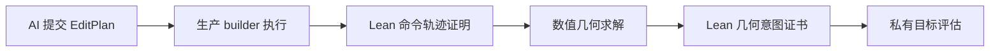

# 用 Lean 验证 AI 编辑命令

## 为什么不能只验证最终 SDF

最终 SDF 只能说明“最后得到什么”，不能说明 AI 是否按允许的方式得到它。一个候选可以拥有
正确的原子数和键表，却在中间移动受保护母核、误删相邻键，或伪造与命令不一致的执行回执。

因此 RetainMol 把验证拆成四层：

1. **命令轨迹**：证明每个 claimed post-state 正好等于基础命令的形式语义。
2. **生产化学规则**：价态、元素支持和锁定对象仍由 builder 决定，不能复制到 UI 或 AI。
3. **几何意图**：受信编排器从用户意图和高阶命令编译锚点、角度、二面角、刚体与碰撞约束。
4. **目标评估**：隐藏参考只在隔离的私有 scorer 中使用，不能逐轮给 proposer 精确 RMSD。

这套方法不要求模型在脑中一次性旋转几百个三维坐标。AI 只需要选择离散操作、锚点、刚性
片段和自由度；坐标由距离几何、力场或 xTB 求解，错误由局部证书定位。

## V1 命令核

`formal/geometry/RetainMolGeometry/Command.lean` 当前定义七种与 `ExpectedEffect V1` 对齐的
基础效果：

- `atom.add`、`atom.replace`、`atom.remove`、`atom.move`；
- `bond.add`、`bond.remove`、`bond.setOrder`。

高阶模板连接、桥接、并环和刚体旋转必须先由独立编译器 lowering 为基础命令轨迹，再进入
这一边界。它们不能各自偷偷实现一套原子/键修改逻辑。

对每一步，回执必须包含完整 post-state。`primitiveCommandTraceIsValid` 是可执行 Bool 判定器；
定理 `primitiveCommandTraceIsValid_sound` 把通过结果提升为
`PrimitiveCommandTraceSemantics` 命题，逐步保存精确状态转移证据。当前还证明了两个基础 frame
condition：移动原子不改变键表，增加键不改变原子表。

严格桥接器 `formal/geometry/tools/command_trace_to_lean.py`：

- 只接受固定 schema 和 `coordinateScale = 1000`；
- 拒绝重复字段、未知字段、未知命令和命令种类不匹配的参数；
- 只序列化数据，不接受调用方提供 Lean 源码；
- proof 模式生成可由 Lean 内核检查的具体命题证明。

## V1 明确不证明什么

命令模块当前证明的是**图效果语义**，不是完整化学合法性。特别是：

- 还没有 runtime projection 等价定理；
- 芳香、配位、selection scope 和完整字段映射尚未进入桥接；
- `bond.add` 的元素价态、剩余价态和元素对规则仍依赖生产 builder；
- charge/radical/add-H 尚未解决所有生成 ID 的确定性；
- 高阶命令还没有经证明的 lowering compiler。

因此 V1 结论应写成“该回执与已编码的基础效果语义一致”，不能写成“Lean 证明该编辑化学正确”。

## 几何证书必须补齐的维度

独立攻击测试已经构造出当前 policy 会放过的八类错误：刚体镜像、错误整体旋转、连接方向
反转、错误二面角、共面退化、非键碰撞、错误键角和过宽键长区间。下一版 `GeometryIntent`
至少需要：

| 意图 | 建议的精确表示 |
| --- | --- |
| 非键排斥 | 原子对平方距离严格正下界 |
| 键角 | 两个键向量的点积区间 |
| 二面角 | 两平面法向量点积和叉积符号 |
| 平面性 | 点到受信平面的有符号距离区间 |
| 连接方向 | 锚点局部 frame 中的向量分量区间 |
| 刚体不镜像 | 全部两两距离加至少一个有向体积检查 |

最终 policy 不能由 AI 直接提交。当前 `RetainMolGeometry/Intent.lean` 已实现最小
`GeometryIntent V1`：起始快照、七种基础命令、完整预期快照和保护锚点。Lean 侧
`compileGeometryPolicy` 生成全部预期键的保守距离范围，并证明成功编译同时意味着：

- 命令序列精确产生预期快照；
- 保护锚点保持完整身份和坐标不变，并且任何中间 atom 命令都不能以这些 ID 为目标；
- policy 由固定编译器生成且 well-formed；
- 预期快照能通过该 policy 的自验证。

V1 尚未进入生产 JSON gate，也没有表达键角、二面角、平面性和 attachment frame。当前定理
名称刻意限定为 `compileGeometryPolicy_self_check_sound`：它证明编译输入与生成策略的自洽，
不声称任意通过策略的 candidate 已满足尚未编码的空间意图。

## 博弈与选择方法

比较不同规划、模板和几何算法时，采用固定轮数的私有基准赛：

1. proposer 只能看到图片、公开任务和自己的公开失败指纹；
2. executor 重放 `EditPlan` 并保存稳定 ID 回执；
3. critic 提交受限、可复验的局部挑战；
4. Lean 检查命令和安全意图，未知能力返回 `INDETERMINATE`；
5. 私有 scorer 在候选哈希锁定后比较隐藏参考；
6. 公开目录只保存 score commitment，不泄露参考 SDF、精确 RMSD 或方向提示；
7. 固定五轮，不因隐藏目标提前成功而终止。

排序先看硬门槛通过数，再看逐 case 胜场、中位私有分数、碰撞数和成本。只有同一冻结 cohort
中的结果可以横向比较。每轮保存内容寻址的请求、响应、EditPlan、回执、候选、formal verdict 和
父回合哈希，以便重放和审计。

## 下一轮实施顺序

1. 从生产 receipt 导出 command trace，并验证 runtime projection 与 Lean trace 字段一致。
2. 先只把 `atom.move/add/remove` 与 `bond.remove` 作为最高可信命令；其余命令在字段和化学 oracle
   对齐后提升等级。
3. 给已形式化的 `GeometryIntent V1` 增加严格 bridge，再依次加入键角、二面角和平面/attachment
   frame，所有退化构型 fail-closed。
4. 继续收紧部署信任根；当前 checker 已单次读取请求、冻结临时快照、核对请求哈希，任何
   Decimal 预检异常都返回 `INDETERMINATE`。
5. 建立无参考泄漏的 tournament public/vault 目录和五轮协议。
