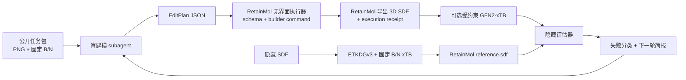

# AI 建模 Loop 工程

## 目标

Loop 工程用于反复检验和改进“从分子图片重建三维结构”的能力。当前首批任务是 `GDG1223` 和 `GDG1476`。两者都以 MR-TADF 中央 B/N 母核为固定坐标锚点，避免每轮比较都被任意平移、旋转干扰。

这不是把隐藏 SDF 交给 subagent 再让它复述答案。建模 agent 只能看到：

- 分子图片；
- 预先放置且锁定的 B/N 原子；
- 允许使用的模板、命令和输出协议。

隐藏的 RetainMol 3D SDF 和评分器只由父级 orchestrator 使用。

## 架构边界



| 层 | 职责 | 禁止事项 |
| --- | --- | --- |
| `mol-viewer/modeling` | 一次 EditPlan 的 schema、dry-run、约束和原子提交 | provider、重试、xTB、评分 |
| `software/backend` | xTB 执行、固定原子和轨迹流 | 读取 viewer store、决定建模策略 |
| `tools/ai_modeling_loop` | 任务隔离、参考生成、评分、运行记录 | UI 业务、修改化学编辑规则 |
| 建模 subagent | 根据公开任务生成可重放 EditPlan | 直接写候选 SDF、调用 RDKit 绕过编辑 API、读取隐藏参考 |

## 目录

```text
data/retainmol_ai_edit/
  GDG1223.png / GDG1223.sdf
  GDG1476.png / GDG1476.sdf
  manifests/*.json
tools/ai_modeling_loop/
  contracts.py     # case 协议
  chemistry.py     # ETKDG 和 xTB adapter
  workspace.py     # 公开任务与隐藏参考
  retainmol_executor.mjs # 只通过 mol-viewer 重放计划并导出 SDF
  region_proposal.py # 动态化学区域提案与外部校验
  region_tree.py     # 递归裁剪、端口继承与叶图编译
  evaluator.py     # 图同构和几何指标
  runner.py        # 不可变运行记录
.retainmol-loop/   # 生成产物，Git 忽略
  tasks/
  references/
  runs/
```

## 标准流程

```bash
npm run ai-loop:doctor
npm run ai-loop:tasks
npm run ai-loop:references

python3 -m tools.ai_modeling_loop record-run \
  --case GDG1223 \
  --edit-plan /path/to/edit-plan.json \
  --builder-notes /path/to/builder-notes.json \
  --refine

npm run ai-loop:scoreboard
```

### 分阶段视觉拓扑审计

复杂图片不能直接一次性生成数百条 `atom.add` / `bond.add`。先运行独立的视觉拓扑
审计，让外部程序核算元素总数、片段所有权、分子式和图论环秩：

```bash
export OPENAI_BASE_URL="http://provider.example"
export OPENAI_API_KEY="..."
export OPENAI_MODEL="vision-model-id"

npm run ai-loop:audit-image -- \
  --image /absolute/path/to/target.png \
  --run-id experiment-001 \
  --max-attempts 3
```

运行记录保存到 `.retainmol-loop/audits/<run-id>/`，每次尝试分别包含提示词、原始
provider 响应、拓扑审计和外部校验结果。程序不接受模型自行声明的 `checkSums`，而是
独立验证以下约束：

- 元素计数之和等于重原子数；
- 每个片段独占的重原子数之和等于总重原子数；
- 片段环秩贡献之和等于总环秩；
- `cycle rank = edge count - vertex count + component count`；
- 分子式与元素计数、隐式氢计数一致。

校验失败时，错误会反馈给模型重新看图；连续两次返回完全相同的错误结果会标记为
`planner-stagnated` 并提前停止。网络和 provider 错误同样归档，不会留下只有堆栈的
半成品。只有审计通过后，后续图提案与分片 EditPlan 编译阶段才应该启动。

### 动态化学区域图

拓扑审计通过后，可以让视觉模型按当前图片生成动态 `RegionGraph`：

```bash
npm run ai-loop:propose-regions -- \
  --image /absolute/path/to/target.png \
  --run-id experiment-regions-001 \
  --max-attempts 3
```

区域数量和名称不由调用方指定，也不存在固定的“中心母核、左右臂、两个螺芴”角色。
规划器只使用以下通用类型：`ring-system`、`branch`、`linker`、
`functional-group`、`coordination-core` 和 `unresolved`。它优先在环外可旋转单键处分割，
螺环用 `shared-atom`，普通连接用 `new-bond`；稠合环默认作为完整区域保留，仅当区域过大
时才沿完整共享边用 `shared-edge` 递归细分。

每个区域带有估计重原子数、环秩和 `needsSubdivision`。不同分子或离子使用不同
`componentId`，同一组分内的区域必须通过互为引用的端口形成连通图。外部校验器还会检查：

- 区域数量在约束范围内，区域 id 和端口 id 全局唯一；
- 区域类型、端口类型和复杂度字段符合 schema；
- 端口位于所属区域矩形内，双向端口类型一致且互相引用；
- 对称组只引用真实区域；
- 同一 `componentId` 内的区域图连通。

若模型只写错了端口的单向引用，系统只在存在唯一反向引用且端口类型一致时做确定性修复；
原始提案保存为 `proposal.raw.json`，修复动作保存为 `repairs.json`。存在多个候选或涉及化学
类型变化时不会自动猜测，仍交回模型或拒绝该提案。

运行记录保存在 `.retainmol-loop/regions/<run-id>/`。其中包含每次提示词、模型提案、
校验结果，以及总览图、逐区域高亮图和裁剪图。后续 region worker 只处理这些动态区域，
不能依赖某个 benchmark 分子的专用命名。

对于标记为 `needsSubdivision` 的区域，使用递归 worker 自动继续拆分：

```bash
npm run ai-loop:plan-region-tree -- \
  --image /absolute/path/to/target.png \
  --run-id experiment-tree-001 \
  --max-depth 2 \
  --max-children 8 \
  --max-attempts 3
```

worker 始终从原始图片按全局坐标裁剪，因此多层裁剪不会累计缩放误差。每层局部提案会：

1. 将局部矩形和端口坐标变换回原图坐标；
2. 用父节点路径为区域和端口加命名空间；
3. 检查子区域确实缩小了搜索范围，并核对重原子数量级；
4. 根据端口位置把父区域的外部连接继承给正确子区域；
5. 将所有层的连接编译为只引用最终叶区域的 `leafGraph`。

完整记录位于 `.retainmol-loop/region-trees/<run-id>/region-tree.json`，同时保留原图、
每个递归节点的裁剪图及各自的 planner 尝试。子规划失败、无法继承端口或达到最大深度时，
父区域会保留为可用叶节点，但整棵树标记为 `complete=false`；CLI 返回非零状态，避免把
不完整结果误交给 EditPlan 编译器。

当单一初始构象仍落入错误局部极小值时，可以增加受控搜索：

```bash
python3 -m tools.ai_modeling_loop record-run \
  --case GDG1476 \
  --edit-plan /path/to/edit-plan.json \
  --refine \
  --conformer-seeds 1,7,31,97
```

该模式将原始构象和各 ETKDGv3 构象分别做固定锚点的 GFN-FF 预松弛，按 GFN-FF
能量选择一个候选，再执行 GFN2。种子与每一阶段都写入 `run.json`，评分结果不会参与
构象选择，避免用隐藏参考反向搜索答案。

`--refine` 会保存 `candidate.raw.sdf`，再用固定锚点的 GFN2-xTB 生成实际评分的
`candidate.sdf`；`run.json` 同时记录原始评分、精修评分、能量和收敛状态。若初始
GFN2 的 SCC 不收敛，runner 会自动执行固定锚点的 GFN-FF 预松弛，再以 1000 K
电子温度重试 GFN2，并逐阶段记录结果。

subagent 不再提交 `candidate.sdf` 或 `candidate.json`。执行器读取公开的
`initial-molecule.json`，强制合并固定/受保护 B、N 锚点约束，再用核心包重放计划。
它生成 `candidate.sdf`、`candidate.json` 和 `execution.json`；回执包含输入、计划、
输出哈希、revision、命令数、change set 与诊断。无法执行的计划仍会形成一次失败记录。

每次带 builder 元数据或 EditPlan 的真实尝试，还会自动备份到
`data/retainmol_ai_edit/loop_history/<case>/<run-id>/`。该目录包含原始 EditPlan、执行
回执、RetainMol 候选、可选精修候选、评分和报告，并由 `index.json` 汇总。临时测试
工作目录不会误写真实历史。

`prepare-references` 默认使用 RDKit ETKDGv3 产生距离几何初始构象，再用
`retainmol-backend` 环境中的 GFN2-xTB 精修。最后通过 `@retainmol/mol-viewer/io`
重新导出单一 `reference.sdf`，在一个文件中保存坐标、元素、键和键级。原始二维 SDF
只参与准备阶段，不进入后续 blind loop。B/N 原子传给 xTB `$fix`；若 xTB 固定原子
仍漂移，loop 会刚体投影并精确复位锚点，同时记录投影前 RMSD。

## 刚性芴与螺环闭合

内置模板 `fluorene-9h-site-a` 和 `fluorene-9h-site-b` 保存同一个刚性 9H-芴构型，
并用显式 `bridgeAttachment` 声明 C9 上两个有序离去 H。螺环建模优先使用一个原子命令
`fragment.bridge`：

1. `atomId1`、`atomId2` 指向两个待替换 H，或有空余价态的重原子；
2. `fragmentId` 选择两个芴模板之一，必要时用 `orientationDegrees` 选择可行圆上的朝向；
3. builder 同时移除两个模板 H 和两个目标 H，两个宿主原子坐标保持不动；
4. C9 在两条目标键长的球面交圆上求解，模板内部结构只做刚体变换；
5. 目标间距或位点夹角不可解时，整条命令失败且不会产生部分结构。

旧 `fragment.attach → atom.remove → bond.add` 三步配方仅保留用于兼容与故障诊断；它能闭合
拓扑，但不会保证第二条闭合键具有合理长度。需要整体调整时使用 `geometry.rotateGroup`，
不能逐原子重排芴骨架。

## 评分顺序

评分先硬后软：

1. 分子式、原子数和单一连通分量；
2. 忽略未指定立体化学的完整图同构、键级和芳香性；
3. B/N 锚点最大位移，小于 `1e-3 Å`；
4. 母核两跳范围 RMSD，小于 `0.5 Å`；
5. 对称映射后的重原子 RMSD，初始阈值 `1.5 Å`；
6. 非键严重碰撞为零；
7. 受约束 xTB 能完成并返回结构。

全局 RMSD 不能单独决定成败。外围苯环存在合理的旋转异构体，因此评估器先做图同构和对称映射，再分别观察母核、外围与碰撞。

## 失败分类与改进位置

| 失败 | 优先修改 |
| --- | --- |
| `formula-mismatch` | 图片识别、元素/氢计数 |
| `topology-mismatch` | 图规划、键级、模板连接/并环 |
| `anchor-drift` | fixed atom 协议、几何命令 |
| `core-geometry` | 母核模板、环融合、键长角度 |
| `peripheral-placement` | 连接向量、二面角和片段翻转 |
| `steric-clash` | 初始放置、扭转搜索、碰撞规避 |
| xTB 失败 | 电荷/多重度、初始结构和后端执行 |

每轮只修改一个主要变量（提示词、模板、命令算法或构象策略），两组样本都不退化才接受。开发时可交替使用 `GDG1223` 做诊断、`GDG1476` 做门禁，下一轮反转，降低只有两个样本时的过拟合风险。

## 真正的任务隔离

仅在 prompt 中写“不要读取 SDF”不构成隔离。建模 subagent 应运行在
`.retainmol-loop/tasks/<case>` 的 projectless 工作目录，只物化 `target.png`、
`initial-molecule.json`、`task.json` 与说明；隐藏参考由父进程评分。subagent 唯一必需
输出是 EditPlan，候选结构只能由父进程执行器产生。后续还需环境变量白名单、超时、
输出大小限制和每次 attempt 独立目录。
