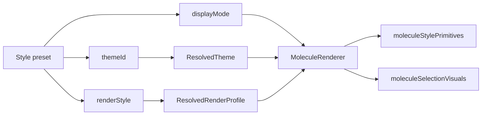

# Molecule Renderer Boundary

This document describes the current renderer split inside `packages/mol-viewer/src/lib/molRenderer`.

The goal is to let multiple people add visual styles without all editing `MoleculeRenderer.ts`.

## Current Ownership

| File | Owns | Should not own |
| --- | --- | --- |
| `MolRenderer.ts` | Three.js scene orchestration, camera, controls, multiple scene objects, renderer lifecycle | Atom/bond material details, chemistry rules |
| `MoleculeRenderer.ts` | Molecule mesh lifecycle, atom/bond update routing, display-mode branching | Theme parsing, public style API, app UI |
| `moleculeStylePrimitives.ts` | Element color resolution, atom radius policy, atom/bond material creation, shader color syncing, object opacity application | Mesh lifecycle, picking, chemistry rules |
| `moleculeSelectionVisuals.ts` | Selection halo, publication outline, bond-drag hover visuals | Atom/bond geometry, material profile registry |
| `renderProfiles.ts` | Renderer profile schema/types and registry | Software-specific UI behavior |
| `profiles/*.ts` | Built-in renderer profile data | Renderer branches named after software |
| `publicationMaterials.ts` | Shader/material implementations | Store or builder behavior |
| `bondGeometry.ts` | Bond perpendicular and geometry helpers | Style preset resolution |
| `sceneRig.ts` | Scene lights, grid, fog synchronization | Molecule mesh lifecycle |

## Style Flow



`MoleculeRenderer` receives resolved style state and should delegate visual decisions to helpers. If a style requires a new material or primitive behavior, add a generic profile field and consume it through `moleculeStylePrimitives` or a new helper.

## Rules for New Renderer Work

Do:

- Add generic `ResolvedRenderProfile` fields such as `bondGeometry`, `bondColorPolicy`, `atomRadiusMode`, or a new explicit capability.
- Put material construction in `moleculeStylePrimitives.ts`.
- Put selection, outline, and hover visuals in `moleculeSelectionVisuals.ts`.
- Put software-specific constants in `styles/profiles/<software>-renderer-profile.ts`.
- Keep `MoleculeRenderer.ts` as a mesh lifecycle coordinator.

Avoid:

- Branching on preset ids such as `iboview-default` or `gaussview-default`.
- Putting app panel logic in renderer files.
- Changing builder/store chemistry behavior for a visual style.
- Applying opacity by traversing all scene materials from `MolRenderer.ts`; object visual state should flow into `MoleculeRenderer`.

## When to Add a New Helper

Add a new helper file when one of these grows beyond a small function:

- atom rendering variants
- bond rendering variants
- aromatic rendering variants
- material/shader factories
- selection and outline visuals
- label rendering

Suggested future split:

```text
MoleculeRenderer.ts
moleculeAtomRenderer.ts
moleculeBondRenderer.ts
moleculeStylePrimitives.ts
moleculeSelectionVisuals.ts
moleculeAromaticVisuals.ts
```

## Smoke Checklist

After changing renderer internals:

```bash
npm run build --workspace @retainmol/mol-viewer
npx vitest run --root packages/mol-viewer
npm run build --workspace retainmol
```

Then browser-smoke at least:

- Place benzene.
- Toggle RetainMol, GaussView, IboView, PyMOL, and Publication presets.
- Toggle ball-stick, stick, tube, wireframe.
- Select atoms and verify halo/outline stays visible.
- Add a second scene object and verify inactive opacity does not corrupt selection or material colors.
